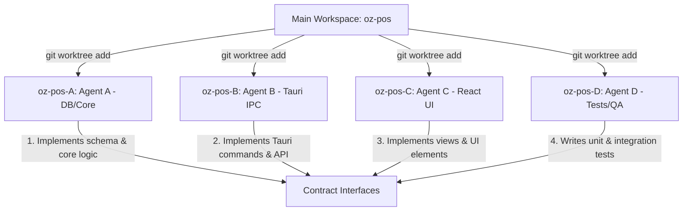

# Multi-Agent Orchestrator (Git Worktrees)

This skill outlines the workflow to partition a feature implementation into 4 parallel coding tasks, set up isolated workspaces using Git Worktrees, generate target prompts for each coding agent, and merge the branches back to main once completed.

## 1. Workflow Architecture
The system is divided into four distinct focus areas. Each area is assigned to one agent operating on a dedicated branch and folder.



## 2. Git Worktree Workspace Setup
To run all 4 agents concurrently, create isolated worktrees from the main workspace folder (`c:\My Script\oz-pos`):

```powershell
# 1. Update main branch
git checkout main
git pull

# 2. Add worktree folders and checkout branches
git worktree add ../oz-pos-A -b feat/freebuff-A-db-layer
git worktree add ../oz-pos-B -b feat/freebuff-B-tauri-ipc
git worktree add ../oz-pos-C -b feat/freebuff-C-react-ui
git worktree add ../oz-pos-D -b test/freebuff-D-specs-qa
```

## 3. Specification Writing Rules
Before prompting the coding agents, the Orchestrator must define **immutable interfaces (contracts)** to prevent implementation drift and merge conflicts. These include:
- Rust Struct & Enum definitions
- Database Schema modifications
- Tauri IPC Command payload & return types
- TypeScript API function signatures

## 4. Prompt Templates

### Agent A: Database & Backend Core
- **Branch:** `feat/freebuff-A-db-layer`
- **Scope:** `crates/oz-core/**/*.rs`, `Cargo.toml`, etc. No front-end/Tauri files.
- **Rules:** Follow Rust standards (Money struct, transactions, doc comments, formatted with `rustfmt`).

### Agent B: Tauri IPC Gateway
- **Branch:** `feat/freebuff-B-tauri-ipc`
- **Scope:** `apps/desktop-client/src/commands/`, `ui/src/api/`
- **Rules:** Hook up commands in `lib.rs` and front-end API wrappers under `ui/src/api/`. Do not invoke commands directly in UI components.

### Agent C: React UI Components
- **Branch:** `feat/freebuff-C-react-ui`
- **Scope:** `ui/src/frontend/` components, styles, animations.
- **Rules:** Use Fluent translations (no hardcoded strings), follow JSX accessibility/ARIA standards.

### Agent D: Tests & QA Verification
- **Branch:** `test/freebuff-D-specs-qa`
- **Scope:** `ui/src/__tests__/`, Rust `#[cfg(test)]` modules, mocks.
- **Rules:** Ensure coverage, run full CI validation locally.

## 5. Integration and Cleanup
Once all agents complete their work and commit locally, execute the following from the main folder (`oz-pos`):

1. Switch to the main branch:
   `git checkout main`
2. Merge the agent branches in order:
   `git merge feat/freebuff-A-db-layer`
   `git merge feat/freebuff-B-tauri-ipc`
   `git merge feat/freebuff-C-react-ui`
   `git merge test/freebuff-D-specs-qa`
3. Remove the worktree folders:
   `git worktree remove ../oz-pos-A`
   `git worktree remove ../oz-pos-B`
   `git worktree remove ../oz-pos-C`
   `git worktree remove ../oz-pos-D`

> [!NOTE]
> If a worktree contains untracked files or uncommitted changes and Git blocks the removal, force the removal with the `--force` flag:
> `git worktree remove ../oz-pos-A --force`


> last audited 19-07-26 by skill-drift-guard
