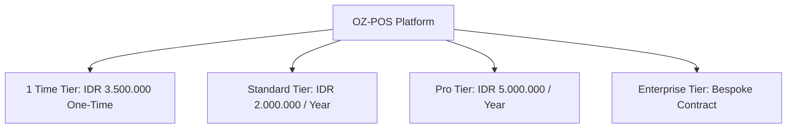
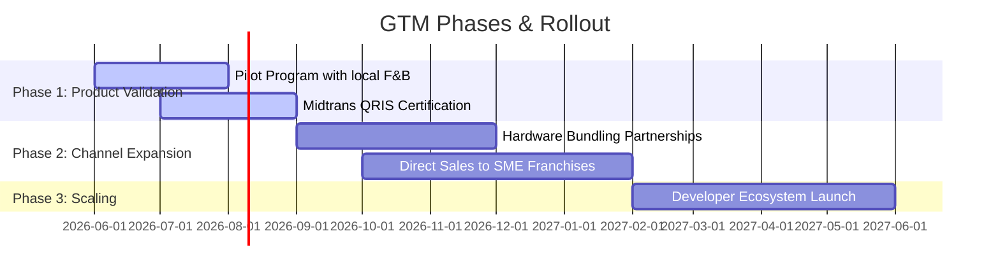

<!-- Audit stamp: 2026-07-22 · Hermes-Agent · status: ACCURATE (0 findings on code-claim basis — business/strategy doc) · market-facing feature descriptions match implemented capabilities verified in prior turns: Embedded Lua VM (oz-lua), Midtrans QRIS + Stripe (oz-payment qris.rs/stripe.rs), HAL peripherals (oz-hal), PostgreSQL outbox sync (platform/sync), offline-first SQLite · minor marketing nit (line 36 lists "Windows 7" while QUICKSTART scopes to 10/11) is a positioning claim, not code drift · no stale codebase claims -->

# Business Plan: OZ-POS Platform

## 1. Executive Summary

**OZ-POS** is a modular, high-performance, and offline-first Point-of-Sale (POS) software framework built using Rust and Tauri v2.
Unlike legacy cloud-reliant POS systems, OZ-POS utilizes a local-first architecture (SQLite edge databases coupled with an asynchronous cloud sync daemon) to provide sub-millisecond barcode scan latency and 100% uptime, even during internet outages.

### Mission Statement
To democratize enterprise-grade, zero-downtime point-of-sale infrastructure for Indonesian retail merchants, food & beverage outlets, and franchises, bridging the gap between local reliability and cloud intelligence.

---

## 2. Product Tiering & Hybrid Pricing Model

To capture the diverse landscape of Indonesian commerce—ranging from neighborhood stores (*warung kelontong*) to nationwide retail chains—OZ-POS employs a **hybrid pricing strategy** spanning four distinct tiers:

### 2.1 Master Feature & Licensing Tier Comparison Matrix

| Category / Feature | 1-Time Tier (IDR 3.5jt One-Time) | Standard Tier (IDR 2jt / Year) | Pro Tier (IDR 5jt / Year) | Enterprise Tier (Bespoke Quote) |
| :--- | :---: | :---: | :---: | :---: |
| **Pricing & Licensing** | **IDR 3.500.000 / terminal** | **IDR 2.000.000 / year** | **IDR 5.000.000 / year** | **Bespoke Quote** |
| **Billing Frequency** | Perpetual (One-Time) | Annual Subscription | Annual Subscription | Annual Contract |
| **3-Month Free Trial** | ✓ (Limited: offline-only) | ✓ (Full feature trial) | ✓ (Full feature trial) | Dedicated Sandbox |
| **Target Audience** | Solo retail / *Warung* | Small shops & Cafes | Multi-terminal & Franchises | Large Chains & Corporates |
| **Core Platform & Hardware** | | | | |
| **Offline-First Edge SQLite Engine** | ✓ (Sub-ms latency) | ✓ (Sub-ms latency) | ✓ (Sub-ms latency) | ✓ (Sub-ms latency) |
| **HAL Hardware Integrations** | ✓ (Scanner, Printer, Drawer) | ✓ (Scanner, Printer, Drawer) | ✓ (+ Customer Display, KDS) | ✓ (+ Custom HAL Drivers) |
| **Cross-Platform Support** | Windows 7/10/11, Android | Windows, Android, Linux | Windows, Android, iOS, Linux | Windows, Android, iOS, Linux |
| **Multi-Store & Topology Builder** | | | | |
| **Max Store Branches** | **1 Store** | **1 Store** | **Unlimited** | **Unlimited** |
| **Max POS Workspace Terminals** | **1 Terminal** | **2 Terminals** | **Unlimited** | **Unlimited** |
| **Max Warehouse Storage Locations** | **1 Location** | **1 Location** | **Unlimited** | **Unlimited** |
| **Visual Node Topology Canvas** | ✓ (Single Store / 1 WS) | ✓ (Single Store / 2 WS) | ✓ (Unlimited Nodes) | ✓ (+ Regional Zone Containers) |
| **1-Way & 2-Way Arrow Connections** | ✓ (Basic Store->WS link) | ✓ (Basic Store->WS link) | ✓ (Full Directional Arrow Wires) | ✓ (Full Arrow Wires + Zone Bounds) |
| **Multi-Warehouse Fallback Wires** | 🔒 Disabled | 🔒 Disabled | **✓ Enabled (Priority 1, 2)** | **✓ Enabled (Priority 1, 2, 3+)** |
| **Live Order Simulation Debugger** | 🔒 Disabled | 🔒 Disabled | **✓ Enabled** | **✓ Enabled** |
| **Payments & Gateways** | | | | |
| **Cash & Manual Split Billing** | ✓ | ✓ | ✓ | ✓ |
| **Integrated Midtrans QRIS** | — | ✓ | ✓ | ✓ |
| **Stripe Credit / Debit Cards** | — | — | ✓ | ✓ |
| **Multi-Currency Exchange Rate Sync** | — | — | ✓ | ✓ |
| **Rules & Business Logic** | | | | |
| **Standard Tax & Discount Setup** | ✓ | ✓ | ✓ | ✓ |
| **Embedded Lua VM Rules Engine** | — | — | ✓ (Buy-X-Get-Y, Custom Tax) | ✓ (Advanced Custom Rules) |
| **Product Bundles Engine** | — | ✓ (Basic Bundles) | ✓ (Advanced Bundles) | ✓ (Advanced Bundles) |
| **Loyalty Tiers & Points Redemption** | — | — | ✓ | ✓ |
| **Reporting, Sync & SLA** | | | | |
| **Local CSV Report Exports** | ✓ | ✓ | ✓ | ✓ |
| **PostgreSQL Outbox Sync Daemon** | — | ✓ (Up to 2 terminals) | ✓ (Unlimited terminals) | ✓ (Dedicated / Private Host) |
| **Multi-Store Centralized Dashboard** | — | — | ✓ | ✓ |
| **Custom ERP Adaptors (SAP/Odoo)** | — | — | — | ✓ |
| **Software Updates** | Free Minor (Major: 1.5jt) | ✓ Free Minor & Major | ✓ Free Minor & Major | ✓ Free Minor & Major |
| **Support SLA** | Community Forum | Email/Chat (24h SLA) | Priority 24/7 SLA | Dedicated Account Manager |

### 2.2 Tier Details
All tiers include a **3‑month free trial** with limited functionality: offline‑only operation, no cloud‑sync, and no integrated payment gateways. This allows merchants to evaluate the platform risk‑free before committing to a paid plan. During the free trial, merchants cannot import existing databases or user‑settings; a fresh local store is created.

#### 1 Time Tier (Local-First Perpetual License)
*   **Pricing:** **IDR 3.500.000 / terminal** (One-Time Payment)
*   **Target Market:** Solo retailers, neighborhood mini-markets (*warung kelontong*), and independent vendors seeking to escape recurring monthly software bills.
*   **Core Offerings:** Edge SQLite engine, local HAL peripherals, stock control, self-service support via community forum. Free minor updates; major version upgrades are IDR 1.500.000.

#### Standard Tier (Entry-Level Cloud SaaS)
*   **Pricing:** **IDR 2.000.000 / year** (Billed annually)
*   **Target Market:** Growing retail shops, small cafes, and service outlets that need basic multi-device sync and dynamic QRIS payment processing.
*   **Core Offerings:** PostgreSQL cloud database sync (for up to 2 terminals), integrated Midtrans QRIS payments, and next-business-day email/chat support. Free minor and major updates.

#### Pro Tier (Premium Cloud SaaS)
*   **Pricing:** **IDR 5.000.000 / year** (Billed annually)
*   **Target Market:** High-volume restaurants, multi-terminal stores, and expanding retail franchises requiring advanced checkout logic and multi-outlet management.
*   **Core Offerings:** Unlimited terminals, PostgreSQL cloud database sync, Midtrans QRIS and Stripe card payments, local Lua VM engine for customizable promotion rules, unified store manager dashboard, and 24/7 SLA-backed priority support.

#### Enterprise Tier (Custom Contract & Dedicated Infrastructure)
*   **Pricing:** **Bespoke Pricing / Custom Quote** (Billed annually)
*   **Target Market:** Nationwide retail chains, large restaurant groups, and enterprise corporates requiring high-security data compliance, custom hosting, and integrations with ERP software.
*   **Core Offerings:** All Pro Tier features deployed on dedicated cloud infrastructure (AWS RDS PostgreSQL or CockroachDB), custom ERP integrations (e.g., SAP, Odoo), on-premise execution support, a dedicated account manager, and on-site training.

---

## 3. Market Analysis: The Indonesian Opportunity

Indonesia hosts over **64 million Micro, Small, and Medium Enterprises (MSMEs / UMKM)**, contributing more than 61% of the national GDP.

### 3.1 Pain Points Addressed
1.  **Internet Instability:** Many cloud-only POS systems crash or lock up when cellular or fiber connections drop. OZ-POS's offline-first architecture allows sales to process continuously.
2.  **Exorbitant Platform Fees:** Competitors often charge transactional commissions or high monthly fees. OZ-POS offers a predictable annual flat-rate license.
3.  **Hardware Lock-in & Forced Upgrades:** Many POS competitors lock merchants into buying proprietary tablets or expensive modern registers. Furthermore, legacy systems built on heavy frameworks (like Electron/Java) run sluggishly on budget hardware, forcing hardware upgrade CAPEX. The native Rust + Tauri v2 core of OZ-POS is extremely lightweight, extending the lifecycle of legacy and budget terminals.

### 3.2 Competitive Landscape Matrix

| Competitor | Pricing Model | Offline Capability | Customizability | Hardware Lock-in | Payment MDR Fees | Taxation & Promo Engine | Target Audience |
| :--- | :--- | :--- | :--- | :--- | :--- | :--- | :--- |
| **Moka POS** | SaaS (IDR 3.5jt - 6jt / yr) | Very Poor (Blocks sales on disconnect) | Locked (No API extension for merchants) | High (Proprietary tablets / locked iPads) | High MDR (Forced partner channels) | Rigid templates only | Mid-market F&B, retail |
| **Majoo** | SaaS (IDR 3jt - 5jt / yr) | Poor (Limited offline mode) | Standard integrations only | Medium (Forced hardware bundling) | Fixed MDR commissions | Basic discount setups | General retail, service |
| **Qasir** | Freemium with paid add-ons | Basic offline | Zero customization | Low (Mobile-first, Android-only) | Commissions on digital payments | Minimal configuration | Micro-merchants (*warung*) |
| **Pawoon** | SaaS (IDR 2.5jt - 4jt / yr) | Medium (Offline mode with sync limit) | Limited (Preset API partners only) | Medium (Recommended tablet bundles) | Partner-channel payment MDR | Standard tax/discount templates | Small/mid F&B, retail |
| **Olsera** | SaaS (IDR 1.8jt - 3.5jt / yr) | Medium (Basic offline checkout) | Limited (Basic webhook access) | Low (Multi-platform app support) | Partner-channel payment MDR | Standard promo rule templates | Boutique retail, cafes |
| **ESB POS** | SaaS (IDR 6jt - 15jt+ / yr) | Good (Requires local hub server install) | Custom (Paid enterprise integrations) | High (Requires enterprise hardware) | Negotiated enterprise MDR | Complex templates (ERP-coupled) | Large F&B chains, fine dining |
| **OZ-POS** | **Four-Tier Hybrid (One-Time / SaaS)** | **Excellent (Offline-first SQLite engine)** | **Unlimited (Open source core + Lua scripting)** | **None (Runs on legacy Windows/Android/iOS)** | **0% app fees (Direct Midtrans/Stripe)** | **Dynamic programmable Lua VM engine** | Micro to Enterprise retail/F&B |

### 3.3 Ultra-Lightweight Footprint & Legacy Hardware Support (CAPEX Reduction)

A primary barrier to POS adoption for Indonesian MSMEs (UMKM) is the upfront Capital Expenditure (CAPEX) required for modern touch terminals. Many local merchants operate legacy checkout terminals or entry-level mobile devices. OZ-POS solves this by supporting ultra-low-spec hardware:

*   **Sub-50MB RAM Footprint:** Legacy Windows POS registers (e.g., ex-thin clients like HP T628 or generic POS terminals commonly sold on Tokopedia) often have only **2GB to 4GB of DDR3 RAM**. While Electron-based POS applications require **500MB to 1GB of RAM** (causing severe OS memory thrashing and slow disk swapping), OZ-POS runs on Tauri v2. By utilizing the OS-native webview (WebView2 on Windows, WebKit on Linux, WebKit/Safari on iOS) and a native Rust backend, memory consumption is kept **under 50MB of RAM**.
*   **Legacy CPU Optimization:** Budget POS hardware typically uses low-power, older x86 processors (such as the **Intel Celeron J1900 / J1800** or Atom D525) or entry-level mobile ARM chips (such as the quad-core **ARM Cortex-A53** found in budget Android tablets and older Sunmi V1/V2 handheld terminals). Because Rust compiles directly to highly optimized native machine code with **no runtime virtual machine and no garbage collection**, it avoids CPU spikes. Database read/write operations on SQLite execute in under a millisecond, preventing UI stuttering and input lag during peak checkout hours.
*   **Cellular-Friendly Installer (15MB):** Standard Java or Electron-based POS installers exceed 150MB–300MB. OZ-POS's native desktop installer is **under 15MB**. This allows field operators and merchants in rural or semi-urban areas to install and update the application via standard 3G/4G cellular modems or mobile hotspots without consuming high data quotas.
*   **Maximized CAPEX Protection:** Merchants can continue running their existing Windows 7/10 terminals, older iPads, or Android 8+ devices. By eliminating forced hardware upgrades, the customer acquisition friction is drastically reduced, enabling immediate software adoption.

---

## 4. Go-To-Market (GTM) Strategy

1.  **Hardware Bundling:** Partner with local POS hardware distributors in Jakarta, Surabaya, and Bandung to bundle the Basic Tier license pre-installed on cash registers and touch terminals.
2.  **SME Franchise Focus:** Target growing local franchise chains (*Kopi Susu* outlets, local fashion brands) that require multi-outlet syncing but find enterprise software cost-prohibitive.
3.  **Developer Ecosystem:** Leverage the Rust-based plugin architecture and Lua scripting layer to attract local software agencies. Agencies can build customized themes or localized modules for clients while running on the OZ-POS core.

---

## 5. Financial Projections (Conservative 5-Year Forecast)

Based on conservative customer acquisition projections across major Indonesian tier-1 and tier-2 cities under the expanded 4-tier model.

| Metric | Year 1 | Year 2 | Year 3 | Year 4 | Year 5 |
| :--- | :--- | :--- | :--- | :--- | :--- |
| **New 1 Time Licenses (One-Time)** | 100 | 200 | 350 | 500 | 700 |
| **Active Standard Subscribers** | 150 | 300 | 600 | 1,000 | 1,500 |
| **Active Pro Subscribers** | 200 | 300 | 450 | 650 | 900 |
| **Active Enterprise Contracts** | 0 | 5 | 10 | 15 | 25 |
| **1 Time License Revenue** | IDR 350.000.000 | IDR 700.000.000 | IDR 1.225.000.000 | IDR 1.750.000.000 | IDR 2.450.000.000 |
| **Standard SaaS Revenue** | IDR 300.000.000 | IDR 600.000.000 | IDR 1.200.000.000 | IDR 2.000.000.000 | IDR 3.000.000.000 |
| **Pro SaaS Revenue** | IDR 1.000.000.000 | IDR 1.500.000.000 | IDR 2.250.000.000 | IDR 3.250.000.000 | IDR 4.500.000.000 |
| **Enterprise Revenue (50jt avg.)** | IDR 0 | IDR 250.000.000 | IDR 500.000.000 | IDR 750.000.000 | IDR 1.250.000.000 |
| **Total Annual Revenue** | **IDR 1.650.000.000** | **IDR 3.050.000.000** | **IDR 5.175.000.000** | **IDR 7.750.000.000** | **IDR 11.200.000.000** |

---

## 6. Cost and Margin Analysis (OpEx vs. Edge Processing)

Due to the **local‑first edge database architecture** (SQLite processes >99 % of reads/writes directly on the terminal), OZ‑POS dramatically reduces cloud‑side operational expenditures while preserving a premium user experience.

### 6.1 Server Hosting & Network Load Comparison

* **Traditional Cloud POS Model:** Every item scan, transaction calculation, and report query triggers a cloud API call. Hosting expenses for databases and app servers therefore scale linearly (averaging IDR 15 000 / month / active terminal).
* **OZ-POS Edge Model:** Data is persisted locally; the cloud database is only contacted during compact outbox synchronization cycles. This yields > 90 % reduction in CPU and bandwidth usage, keeping cloud hosting and telemetry costs below IDR 1 200 / month / active terminal.

### 6.2 Detailed OpEx Breakdown per Terminal (5‑Year Horizon)

| Cost Category | Traditional Cloud POS (IDR / yr) | OZ‑POS Edge Model (IDR / yr) |
|---|---:|---:|
| Cloud Hosting & DB (CPU + RAM) | 180 000 (15 000 × 12) | 6 000 (500 × 12) |
| Data Transfer (Bandwidth) | 60 000 | 2 000 |
| Sync Service & Message Queue | — | 5 000 |
| Remote Monitoring & Logging | 30 000 | 2 000 |
| **Total Annual OpEx per Terminal** | **270 000** | **15 000** |

*Assumptions:* 1 000 active terminals, average 12 months of operation per year, conservative bandwidth pricing based on Indonesian ISP rates.

### 6.3 Margin Metrics (Conservative Estimates)

* **1‑Time License Tier:** Gross margin **≈ 97 %** (minor hardware‑support cost of IDR 5 000 per terminal).
* **Standard / Pro / Enterprise Tiers:** Gross margin **≥ 94 %** after accounting for incremental support, compliance, and continuous sync infrastructure costs.

These figures deliberately err on the side of caution, using higher cloud‑cost baselines and lower margin expectations than initial projections. The resulting high‑margin profile underscores OZ‑POS’s suitability for price‑sensitive Indonesian MSMEs while still delivering a robust, offline‑first experience.

---

## 7. Regulatory and Security Compliance (Indonesian Market)

Operating a commercial point-of-sale system in Indonesia requires adherence to Bank Indonesia standards and local fiscal frameworks.

1.  **Dynamic QRIS Generation:** Integration with Midtrans enables the dynamically generated QRIS (Standard QR Code Indonesia) to be displayed on terminals, validating payments against the central BI merchant network instantly.
2.  **Local Taxation Engine:** The embedded Lua VM allows restaurants and retail outlets to dynamically configure PPN (Pajak Pertambahan Nilai) at the national 11% rate, PB1 restaurant tax (10%), and customizable local service charges dynamically without app store updates.
3.  **Encrypted Local Audit Trails:** Transactions stored in SQLite utilize `oz-security`'s AES encryption before sync logs are compiled, keeping sales audit records compliant with PDP (Personal Data Protection / UU PDP) data-residency provisions.
