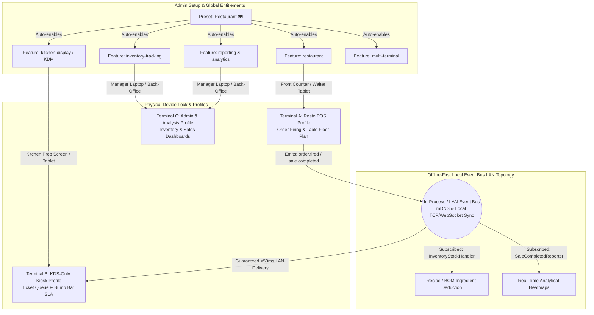

# Modular Application Master Plan: Feature-Based Configuration & Execution Roadmap

**Status:** Active Planning Document  
**Target Architecture:** Admin-Configurable Feature & Module Engine (`oz-pos`)  
**Version:** 4.0 (Granular Step-by-Step Breakdown + Docker Cloud Server)  

---

## Master Progress Tracker

| Phase | Area | Total Tasks | Done |
| :--- | :--- | ---: | ---: |
| 1 | Admin Setup & Preset Polish | 10 | 10 |
| 2 | Dynamic Runtime Kernel & Safeguards | 10 | 10 |
| 3 | Restaurant Workflow & Offline LAN KDS Sync | 13 | 13 |
| 4 | Packaging, Plugin Ecosystem & Automated Testing | 5 | 2 |
| 5 | Cloud Server & Docker Containerization | 8 | 2 |
| | **Total** | **46** | **40** |

---

## 1. Executive Summary & Vision

The core philosophy of **OZ-POS** is to provide a **zero-bloat, highly adaptable Point-of-Sale system** where the store administrator controls exactly what capabilities are enabled. Whether the business is a quick-service cafe, a full-service restaurant ("Resto"), a multi-terminal retail store, or a franchise chain, the interface and underlying services adapt dynamically.

Instead of presenting every user with a complex, monolithic interface, the administrator selects the active features (or picks a template preset like **Restaurant** or **Simple Retail**). The system then:
1. Activates only the necessary backend **Rust modules and event handlers**.
2. Unlocks the appropriate **Workspaces** (`restaurant-pos`, `store-pos`, `kds`, `inventory`, `admin`) for staff members.
3. Dynamically renders only the required **UI screens, navigation buttons, and dashboard widgets** via frontend registries.
4. Enforces strict **runtime safety guards and offline-first local network synchronization** across physical hardware devices.

---

## 2. Current State Assessment

We have already established the foundational architecture across the Rust backend (`crates/`, `platform/`, `modules/`) and React/TypeScript frontend (`ui/`):

| Layer | Component / Location | Current Capability |
| :--- | :--- | :--- |
| **Backend Core Flags** | `crates/oz-core/src/features.rs` | Enforces **32 granular feature flags** across 8 logical groups (`Core`, `Payments`, `Products`, `Staff`, `Hardware`, `Business Rules`, `Restaurant`, `Scaling`, `Reporting`, `Advanced`). Includes automatic bottom-up dependency resolution (`FeatureRegistry::enable`). |
| **Setup Wizard & Presets** | `ui/src/features/setup/SetupWizard.tsx` | Provides **4 built-in presets**: `Simple Retail` (🛒), `Restaurant` (🍽️), `Full Store` (🏪), and `Custom` (⚙️). Presets pre-check exact bundles of feature flags during initial store setup. |
| **Admin Feature Toggles** | `ui/src/features/settings/FeatureToggleScreen.tsx` `apps/desktop-client/src/commands/features.rs` | Admin can toggle flags post-setup via IPC (`list_all_features`, `set_feature`). Persists directly to SQLite `settings` table (`feature.<key> = "1"`). Auto-enables dependencies and cascades terminal auto-registration (`MultiTerminal`). |
| **UI Registry System** | `ui/src/platform/ui/page-registry/index.ts` `ui/src/platform/ui/menu-registry/index.ts` | Screens and sidebar items register with an optional `feature` requirement (e.g. `registerPage({ route: 'kds', feature: 'kitchen-display' })`). |
| **Frontend Feature Hook** | `ui/src/hooks/useFeatures.ts` | React components subscribe to `useFeatures()`, which provides `isEnabled(key)` and `filterRoutes()` to hide disabled tabs and routes instantly. |
| **Workspace Routing** | `ui/src/features/workspaces/WorkspaceHome.tsx` `ui/src/contexts/WorkspaceContext.tsx` | Organizes workflows into **5 Workspaces**: `restaurant-pos`, `store-pos`, `kds`, `inventory`, and `admin`. Filtered by user role and store feature entitlements. |

---

## 3. Deep Dive: Restaurant ("Resto") Module Stack & Inter-Terminal Topology

For a restaurant workflow (`resto pos, kdm, inventory, analysis`), the active stack maps across all three architectural boundaries while supporting multiple physical devices on the local network:

---

## 4. Detailed Step-by-Step Execution Breakdown

Every phase and high-level objective is broken down below into actionable, atomic engineering tasks with precise target files, methods, schemas, and verification steps:

---

### Phase 1: Admin Setup & Preset Polish (Quick Wins) `[10/10]`

#### 1.1 Expand Preset Templates (`Quick Service Cafe / Bakery`, `Franchise Restaurant`)

- [x] **1.1.1 [Rust Core Presets]**: In `crates/oz-core/src/features.rs`, add `cafe()` and `franchise()` constructors to `FeatureRegistry`. Define their exact feature sets:
  - `cafe()`: `SimpleRetail`, `CashPayment`, `CardPayment`, `ReceiptPrinting`, `CustomerDisplay`, `DiscountEngine`, `TaxEngine`, `KitchenDisplay`, `PromotionsEngine`.
  - `franchise()`: `Restaurant`, `CashPayment`, `CardPayment`, `MultiCurrency`, `InventoryTracking`, `ProductVariants`, `CategoriesEnabled`, `StaffLogin`, `StaffRoles`, `ShiftManagement`, `AuditLog`, `ReceiptPrinting`, `DiscountEngine`, `TaxEngine`, `KitchenDisplay`, `TableManagement`, `CloudSync`, `MultiStore`, `MultiTerminal`, `Reporting`, `Analytics`.
- [x] **1.1.2 [Rust Preset Unit Tests]**: Add unit tests in `crates/oz-core/src/features.rs` ensuring `FeatureRegistry::cafe()` and `FeatureRegistry::franchise()` pass dependency closure validation (`from_set` assert).
- [x] **1.1.3 [Setup Wizard UI Types]**: In `ui/src/features/setup/SetupWizard.tsx`, expand `Preset` union type to `Preset = 'simple-retail' | 'restaurant' | 'full-store' | 'cafe' | 'franchise' | 'custom'`. Update `PRESETS` array with option objects (`emoji`, `name`, `description`). Update `PRESET_FEATURES` mapping with exact kebab-case keys.
- [x] **1.1.4 [i18n Localization]**: Add Fluent strings (`setup-preset-cafe-name`, `setup-preset-cafe-desc`, `setup-preset-franchise-name`, `setup-preset-franchise-desc`) across `ui/src/locales/en-US/*.ftl` and corresponding translations.

#### 1.2 Real-time Setup Preview (Live Navigation & Workspace Indicator Box)

- [x] **1.2.1 [Preview Component Creation]**: Create `ui/src/features/setup/components/LiveSetupPreview.tsx` accepting prop `{ selectedFeatures: Set<string> }`.
- [x] **1.2.2 [Workspace Matcher Logic]**: In `LiveSetupPreview.tsx`, compute which of the 5 Workspaces (`restaurant-pos`, `store-pos`, `kds`, `inventory`, `admin`) are active based on `selectedFeatures` and display them with their accent badge colors (`WS_COLORS`).
- [x] **1.2.3 [Sidebar Navigation Matcher]**: Use `getNavItems(selectedFeatures, 'owner')` (`menu-registry`) to compute and render the exact list of navigation items (`sales`, `kds`, `products`, `inventory`, `settings`, etc.) that will appear on the staff sidebar.
- [x] **1.2.4 [Wizard & Settings Integration]**: Embed `<LiveSetupPreview selectedFeatures={...} />` into `SetupWizard.tsx` (on Step 8 Review and side panel) and into `FeatureToggleScreen.tsx`.

#### 1.3 Category Search & Bulk Controls in Feature Toggle Screen

- [x] **1.3.1 [Keyword Search Bar UI]**: In `FeatureToggleScreen.tsx` (`ui/src/features/settings/FeatureToggleScreen.tsx`), add `searchQuery` state and search input box. Filter `grouped` items so only features whose `key`, `name`, or `description` match `searchQuery` case-insensitively are displayed.
- [x] **1.3.2 [Group Bulk Action Buttons]**: In `FeatureToggleScreen.tsx`, render "Enable All" and "Disable All" buttons in the header of each group category card (`Core`, `Hardware`, `Business Rules`, etc.).
- [ ] **1.3.3 [Bulk IPC Backend Command]**: Implement `set_features_bulk(keys: Vec<String>, enabled: bool)` in `apps/desktop-client/src/commands/features.rs` and register it in `lib.rs` so toggling an entire group of features executes atomically in a single SQLite transaction and returns the updated `ListAllFeaturesResult`.

---

### Phase 2: Dynamic Runtime Kernel & Safeguards (Backend Polish) `[4/10]`

#### 2.1 Dynamic Module Lifecycle (`platform/kernel`)

- [x] **2.1.1 [Kernel Module Status Tracking]**: In `platform/kernel/src/kernel.rs`, update `Kernel` struct to maintain runtime state per registered module: `ModuleStatus::Registered | Loaded | Started | Stopped`.
- [x] **2.1.2 [Runtime Start/Stop Methods]**: Implement `kernel.start_module(id: &str)` and `kernel.stop_module(id: &str)`. When `stop_module` is called, invoke `module.stop()`, `module.unload()`, and update status to `Stopped`.
- [x] **2.1.3 [Dynamic EventBus Unsubscribe]**: In `platform/kernel/src/event_bus.rs`, add subscription ownership tags (`module_id`) when handlers are registered (`bus.subscribe_for_module(module_id, topic, handler)`). Implement `bus.unsubscribe_module(module_id: &str)` to cleanly drop all handlers owned by a stopped module.
- [x] **2.1.4 [IPC Command to Kernel Wiring]**: Connect `set_feature` in `apps/desktop-client/src/commands/features.rs` to invoke `kernel.start_module()` when a top-level module feature is enabled, and `kernel.stop_module()` when disabled, without restarting the application.

#### 2.2 Active Operation Guards (Safe Disabling Validation)

- [x] **2.2.1 [Guard Trait & Error Structure]**: In `crates/oz-core/src/features.rs` (or `platform/kernel/`), define `pub trait FeatureGuard: Send + Sync { fn can_disable(&self, feature: Feature, conn: &Connection) -> Result<(), String>; }`.
- [x] **2.2.2 [KDS Tickets Safety Guard]**: Implement `KdsFeatureGuard`. When `feature == Feature::KitchenDisplay`, query `SELECT COUNT(*) FROM kds_orders WHERE status IN ('pending', 'preparing')`. If count > 0, return `Err(format!("Cannot disable Kitchen Display while {} tickets are actively in progress", count))`.
- [x] **2.2.3 [Shift Reconciliation Safety Guard]**: Implement `ShiftFeatureGuard`. When `feature == Feature::ShiftManagement`, query `SELECT COUNT(*) FROM shifts WHERE closed_at IS NULL`. If count > 0, return `Err("Cannot disable Shift Management while a shift is actively open and unreconciled")`.
- [x] **2.2.4 [IPC Guard Integration]**: In `set_feature` (`apps/desktop-client/src/commands/features.rs`), run all registered `FeatureGuard` checks before mutating `FeatureRegistry`. If any guard returns an `Err`, abort the transaction and return the actionable error string.

#### 2.3 Terminal Profiles & Kiosk Lock

- [x] **2.3.1 [SQLite Schema Migration]**: In `crates/oz-core/src/db/migrations/`, add migration table `terminal_profiles` (`terminal_id TEXT PRIMARY KEY, profile_type TEXT NOT NULL, locked_screen TEXT, updated_at TIMESTAMP DEFAULT CURRENT_TIMESTAMP`). Profile types: `'counter_pos' | 'kds_kiosk' | 'customer_display' | 'unrestricted'`.
- [x] **2.3.2 [Terminal Profile IPC Commands]**: Implement `get_terminal_profile(terminal_id: String) -> Result<TerminalProfileDto, AppError>` and `set_terminal_profile(terminal_id: String, profile_type: String)` in `apps/desktop-client/src/commands/terminals.rs`.
- [x] **2.3.3 [UI Kiosk Lockdown Guard]**: In `ui/src/frontend/shell/AppShell.tsx`, load `activeTerminalProfile` via hook `useTerminalProfile()`. If `profile_type === 'kds_kiosk'`, bypass the workspace picker (`WorkspaceHome`), force `currentRoute = 'kds'`, and hide the top header and back buttons to prevent leaving KDS mode.

---

### Phase 3: Restaurant Workflow & Offline LAN KDS Sync `[0/13]`

#### 3.1 Recipe / Bill of Materials (BOM) Stock Deduction

- [x] **3.1.1 [SQLite BOM Schema]**: Create migration adding table `product_recipes` (`id TEXT PRIMARY KEY, parent_product_id TEXT NOT NULL, ingredient_product_id TEXT NOT NULL, quantity_required INTEGER NOT NULL, unit TEXT NOT NULL, FOREIGN KEY(parent_product_id) REFERENCES products(id), FOREIGN KEY(ingredient_product_id) REFERENCES products(id))`.
- [x] **3.1.2 [Recipe Repository & Domain]**: In `crates/oz-core/src/recipe.rs` + `crates/oz-core/src/db/recipes.rs`, implement `RecipeItem` domain type and `Store::get_recipe_ingredients(parent_product_id) -> Result<Vec<RecipeItem>, CoreError>`.
- [x] **3.1.3 [InventoryStockHandler Upgrade]**: Upgrade `modules/inventory/src/handlers.rs` (`InventoryStockHandler::handle`). When processing `SaleCompleted`, check each sold SKU's recipe. If BOM ingredients exist, deduct `qty × quantity_required` from each ingredient; otherwise deduct the product directly.

#### 3.2 Order Modifiers & Coursing Engine

- [x] **3.2.1 [Modifiers Schema & DTOs]**: Create migration adding `modifier_groups` (`id TEXT PRIMARY KEY, name TEXT NOT NULL, min_selections INTEGER DEFAULT 0, max_selections INTEGER DEFAULT 1`), `modifiers` (`id TEXT PRIMARY KEY, group_id TEXT NOT NULL, name TEXT NOT NULL, price_minor_units INTEGER DEFAULT 0`), and `product_modifier_groups` (`product_id TEXT NOT NULL, group_id TEXT NOT NULL`).
- [x] **3.2.2 [Resto PosScreen Modifiers UI]**: Build `ui/src/features/sales/components/ItemModifierModal.tsx`. Tapping a menu item with attached modifier groups opens the modal, enforces selection limits (`min_selections`/`max_selections`), calculates total price adjustment, and appends modifier metadata to `CartItem`.
- [x] **3.2.3 [Course Firing State Engine]**: Add `course_id: 'appetizer' | 'main' | 'dessert' | 'drinks'` and `coursing_status: 'hold' | 'fired'` to `CartLine` in `domain.ts`. Add `assignCourse`, `fireCourse`, `fireAllCourses` to `usePosState`. Add "Fire Course" button bar in `PosScreen.tsx` for restaurant-pos workspace.

#### 3.3 KDS Ticket State Machine & SLA Alerts

- [x] **3.3.1 [KDS Ticket Schema & Transitions]**: Add CHECK constraint on `kds_orders.status` via table recreation (SQLite limitation). Existing timestamp columns (`received_at`, `started_at`, `ready_at`, `served_at`) verified present. Add `kds_orders` and `kds_daily_counters` to expected_tables.
- [x] **3.3.2 [SLA Aging Timer Hook]**: Create `ui/src/features/kds/hooks/useTicketSla.ts` accepting `created_at: string`. Computes elapsed seconds every second (`setInterval`) and returns threshold level (`'green' | 'yellow' | 'red'`). Green: `< 600s` (10m), Yellow: `600s..900s`, Red: `> 900s` (15m).
- [x] **3.3.3 [KDS Screen Visual & Audio Alerts]**: Upgrade `ui/src/features/kds/KdsScreen.tsx` with `<KdsTicketCard>` component that applies dynamic SLA classes (`kds-ticket--green`, `kds-ticket--yellow`, `kds-ticket--red`) based on `useTicketSla`. Audio chime (`playAlert`) fires when a ticket transitions into the `red` threshold.

#### 3.4 LAN / mDNS Peer-to-Peer KDS Discovery

- [x] **3.4.1 [mDNS Service Broadcaster]**: In `crates/oz-core/src/sync/lan_discovery.rs`, implement `LanDiscoverer` advertising service `_oz-pos._tcp.local.` with TXT records `terminal_id`, `role`, and `tcp_port`.
- [x] **3.4.2 [Local TCP/WebSocket Event Forwarder]**: Implement a lightweight TCP/WebSocket server inside `apps/desktop-client` (`port 9180`). When `sale.completed` or `order.course_fired` is emitted on Resto POS, forward the JSON event directly over LAN TCP to all connected KDS tablet peers.
- [x] **3.4.3 [LAN Offline Buffer & Reconnection]**: Add heartbeat ping (`every 5s`) between Resto POS desktop and KDS tablets. If LAN Wi-Fi drops, buffer fired tickets locally in `offline_lan_queue` and flush immediately upon TCP reconnection.

#### 3.5 Menu Engineering Analytics Matrix

- [x] **3.5.1 [Analytics Aggregation Query]**: In `crates/oz-reporting/src/menu_engineering.rs`, write SQL aggregation calculating total volume (`SUM(quantity)`) and total contribution margin (`SUM((unit_price - unit_cost) * quantity)`) per product over a selected date range.
- [ ] **3.5.2 [Quadrants Calculator Engine]**: Calculate median volume and median margin across all sold items. Assign classification:
  - **Star**: Volume ≥ Median AND Margin ≥ Median.
  - **Plowhorse**: Volume ≥ Median AND Margin < Median.
  - **Puzzle**: Volume < Median AND Margin ≥ Median.
  - **Dog**: Volume < Median AND Margin < Median.
- [ ] **3.5.3 [Matrix Scatter Plot & Table UI]**: Create `ui/src/features/reports/MenuEngineeringScreen.tsx` rendering an interactive 4-quadrant scatter plot and actionable recommendations ("Promote Star", "Increase Price on Plowhorse", "Reposition Puzzle", "Remove Dog").

---

### Phase 4: Packaging, Plugin Ecosystem & Automated Matrix Testing `[0/5]`

#### 4.1 Module Manifest Verification

- [x] **4.1.1 [JSON Schema Spec Definition]**: Create formal JSON schema `docs/specs/module-manifest.schema.json` defining mandatory properties (`id`, `name`, `version`, `author`, `dependencies`, `permissions`, `database_namespace`).
- [x] **4.1.2 [Manifest Validator in Kernel]**: In `platform/kernel/src/manifest.rs`, validate `manifest.json` against `module-manifest.schema.json` during `kernel.register()`. Return structured `ManifestError` if validation fails.

#### 4.2 Sandboxed Plugin Loader (`crates/oz-plugin` + `crates/oz-lua`)

- [x] **4.2.1 [.ozpkg Archive Reader]**: Implement `.ozpkg` file parser in `crates/oz-plugin/src/package.rs` (reading zip archives containing `manifest.json`, SQLite migrations, and Lua scripts).
- [x] **4.2.2 [Isolated Database Namespace]**: Enforce prefix restrictions (`plugin_<id>_*`) on all SQLite statements executed by plugins to prevent modifying core `sales` or `users` tables directly.
- [x] **4.2.3 [Lua Event Bus Bridge]**: In `crates/oz-lua/src/bridge.rs`, expose event subscription callbacks to Lua scripts (`oz.on("sale.completed", function(event) ... end)`) for custom peripheral hardware drivers or local accounting hooks.

#### 4.3 Feature Matrix Automated Testing

- [ ] **4.3.1 [Rust Preset Integration Test Suite]**: In `crates/oz-core/tests/feature_matrix_tests.rs`, iterate over all 6 built-in presets (`simple_retail`, `restaurant`, `full_store`, `cafe`, `franchise`, `custom`) verifying `from_set` succeeds, `count()` matches expected, and `to_settings_rows()` roundtrips cleanly (`from_settings_rows`).
- [ ] **4.3.2 [Frontend Registry Parity CI Gate]**: Create validation script `scripts/verify-feature-registry.py` and register it inside `scripts/check.sh`. Verifies that every `feature: string` referenced in `registerPage` or `registerNavItem` exists precisely in `FEATURES` (`useFeatures.ts`) and `crates/oz-core/src/features.rs`.

---

### Phase 5: Cloud Server & Docker Containerization `[0/8]`

#### 5.1 Headless Cloud Server Binary (`apps/cloud-server`)

- [x] **5.1.1 [Crate Scaffolding]**: Create new Cargo crate `apps/cloud-server/` (`Cargo.toml`) depending on `oz-api`, `oz-core`, `platform-sync`, and `tokio`. Ensure no Tauri or WebView UI crates are linked.
- [x] **5.1.2 [Sync Transport Receiver Endpoints]**: In `apps/cloud-server/src/sync_api.rs`, wire `POST /api/sync/push` and `POST /api/sync/pull` handlers accepting `PushResponse` / `PullRequest` bodies (`platform/sync/src/transport.rs`) and persisting to the central server database.
- [ ] **5.1.3 [Main Async Entrypoint]**: In `apps/cloud-server/src/main.rs`, initialize structured logging (`oz-logging`), open central database pool (`OZ_DB_PATH` / PostgreSQL connection string), run pending schema migrations, and spawn `oz_api::serve()` alongside `sync_api` routes on `OZ_API_PORT` (default `3099`).

#### 5.2 Tenant ID / Store ID Scoping (Multi-Store Cloud Separation)

- [ ] **5.2.1 [Store ID Schema & Auth Claim]**: Add `tenant_id TEXT NOT NULL DEFAULT 'default'` column to `offline_queue` and central mutations log. Update JWT token generator/validator (`crates/oz-api/src/auth.rs`) to embed `tenant_id` claim in `Bearer` tokens.
- [ ] **5.2.2 [Scoped Sync Queries]**: Update `/api/sync/push` and `/api/sync/pull` endpoint queries (`apps/cloud-server/src/sync_api.rs`) to filter all incoming and outgoing items strictly by `WHERE tenant_id = ?1` extracted from the caller's JWT token.
- [ ] **5.2.3 [Multi-Tenant Isolation Tests]**: Add integration test `tests/multi_tenant_sync_test.rs` spinning up `cloud-server` with two distinct tokens (`Tenant A` and `Tenant B`). Assert mutations pushed by Tenant A are completely invisible when Tenant B calls `pull`.

#### 5.3 Production Docker & Compose Setup (`Dockerfile.server` & `docker-compose.yml`)

- [ ] **5.3.1 [Multi-Stage Dockerfile]**: Create `Dockerfile.server` in root with two stages:
  - Stage 1 (`builder`): `FROM rust:1.80-slim`, `cargo build --release --bin cloud-server`.
  - Stage 2 (`runtime`): `FROM debian:bookworm-slim`, copy binary to `/usr/local/bin/cloud-server`, expose `3099`, set `VOLUME ["/data"]`, and `ENTRYPOINT ["cloud-server"]`.
- [ ] **5.3.2 [Docker Compose Topology]**: Create `docker-compose.yml` defining two services:
  - `pos-cloud-server`: built from `Dockerfile.server`, port `3099:3099`, environment `OZ_DB_PATH=/data/cloud.db` (or `DATABASE_URL=postgres://...`), volume `oz_cloud_data:/data`.
  - `pos-cloud-db` (optional): `postgres:16-alpine` container with health checks and persistent storage volume for enterprises using PostgreSQL replication (`pg_transport.rs`).
- [ ] **5.3.3 [Automated Container CI Build Test]**: Add CI workflow step in `.github/workflows/` (`or scripts/check.sh --docker-dry-run`) executing `docker build -f Dockerfile.server -t oz-pos-cloud:test .` ensuring clean container build and binary size verification (`< 50MB`).

---

## 6. Next Steps for Execution

Whenever we are ready to start building, we can pick any sub-item above (e.g. **1.1.1 [Rust Core Presets]**, **3.1.1 [SQLite BOM Schema]**, or **5.1.1 [Headless Server Crate Scaffolding]**), write the code and tests, verify against `cargo test` / `npm test` / `docker build`, and mark the item completed (`[x]`) while preserving 100% documentation integrity and our version lock (`0.0.3`).
