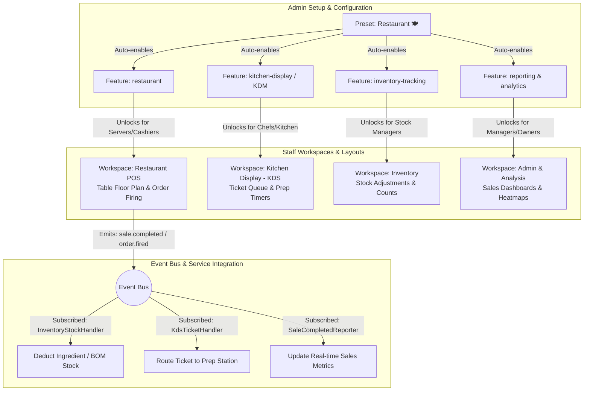

# Modular Application Master Plan: Feature-Based Configuration & Execution Roadmap

**Status:** Active Planning Document  
**Target Architecture:** Admin-Configurable Feature & Module Engine (`oz-pos`)  
**Version:** 1.0  

---

## 1. Executive Summary & Vision

The core philosophy of **OZ-POS** is to provide a **zero-bloat, highly adaptable Point-of-Sale system** where the store administrator controls exactly what capabilities are enabled. Whether the business is a quick-service cafe, a full-service restaurant ("Resto"), a multi-terminal retail store, or a franchise chain, the interface and underlying services adapt dynamically.

Instead of presenting every user with a complex, monolithic interface, the administrator selects the active features (or picks a template preset like **Restaurant** or **Simple Retail**). The system then:
1. Activates only the necessary backend **Rust modules and event handlers**.
2. Unlocks the appropriate **Workspaces** (`restaurant-pos`, `kds`, `inventory`, `admin`) for staff members.
3. Dynamically renders only the required **UI screens, navigation buttons, and dashboard widgets** via frontend registries.

---

## 2. Current State Assessment

We have already established the foundational architecture across the Rust backend (`crates/`, `platform/`, `modules/`) and React/TypeScript frontend (`ui/`):

| Layer | Component / Location | Current Capability |
| :--- | :--- | :--- |
| **Backend Core Flags** | `crates/oz-core/src/features.rs` | Enforces **32 granular feature flags** across 8 logical groups (`Core`, `Payments`, `Products`, `Staff`, `Hardware`, `Business Rules`, `Restaurant`, `Scaling`, `Reporting`, `Advanced`). Includes automatic bottom-up dependency resolution (`FeatureRegistry::enable`). |
| **Setup Wizard & Presets** | `ui/src/features/setup/SetupWizard.tsx` | Provides **4 built-in presets**: `Simple Retail` (🛒), `Restaurant` (🍽️), `Full Store` (🏪), and `Custom` (⚙️). Presets pre-check exact bundles of feature flags during initial store setup. |
| **Admin Feature Toggles** | `ui/src/features/settings/FeatureToggleScreen.tsx` `apps/desktop-client/src/commands/features.rs` | Admin can toggle flags post-setup via IPC (`list_all_features`, `set_feature`). Persists directly to SQLite `settings` table (`feature.<key> = "1"`). Auto-enables dependencies and cascades terminal auto-registration (`MultiTerminal`). |
| **UI Registry System** | `ui/src/platform/ui/page-registry/index.ts` `ui/src/platform/ui/menu-registry/index.ts` | Screens and sidebar items register with an optional `feature` requirement (e.g. `registerPage({ route: 'kds', feature: 'kitchen-display' })`). |
| **Frontend Feature Hook** | `ui/src/hooks/useFeatures.ts` | React components subscribe to `useFeatures()`, which provides `isEnabled(key)` and `filterRoutes()` to hide disabled tabs and routes instantly. |
| **Workspace Routing** | `ui/src/features/workspaces/WorkspaceHome.tsx` `ui/src/contexts/WorkspaceContext.tsx` | Organizes workflows into **5 Workspaces**: `restaurant-pos`, `store-pos`, `kds`, `inventory`, and `admin`. Filtered by user role and store feature entitlements. |

---

## 3. Deep Dive: Restaurant ("Resto") Module Stack

For a restaurant workflow (`resto pos, kdm, inventory, analysis`), the active stack maps across all three architectural boundaries:

### Module Breakdown for Restaurant Mode:
1. **Resto POS (`modules/sales` + `modules/restaurant`)**:
   * **Core Responsibilities**: Interactive table floor plan (`TableManagementScreen`), course firing (Appetizer, Main, Dessert), bill splitting (split by item, split evenly), and table status tracking (Vacant, Occupied, Billed, Cleaning).
   * **Key Feature Flags**: `restaurant`, `table-management`, `discount-engine`, `tax-engine`.

2. **KDM / KDS (`modules/kitchen` / `ui/src/features/kds`)**:
   * **Core Responsibilities**: Kitchen Display System monitor. Routes order tickets to prep stations based on item categories (e.g. Beverages to Bar screen, Steaks to Grill screen). Displays ticket aging timers and supports bump bar / touchscreen ticket completion.
   * **Key Feature Flags**: `kitchen-display`, `restaurant`.

3. **Inventory & BOM (`modules/inventory`)**:
   * **Core Responsibilities**: Ingredient-level stock deduction. When a "Cheeseburger" is sold in Resto POS, the recipe/BOM (Bill of Materials) automatically deducts 1x Burger Bun, 1x Beef Patty, and 1x Cheese Slice via the event bus (`sale.completed` → `InventoryStockHandler`).
   * **Key Feature Flags**: `inventory-tracking`, `product-variants`, `categories-enabled`, `stock-counting`.

4. **Analysis & Reporting (`modules/reporting` + `crates/oz-reporting`)**:
   * **Core Responsibilities**: Restaurant-specific analytical insights:
     * **Menu Engineering Matrix**: Star vs. Plowhorse vs. Puzzle vs. Dog classification based on profitability and popularity.
     * **Hourly Sales & Dining Heatmap**: Peak seating times and table turnover rate.
     * **Ingredient Waste & Valuation Report**: Tracking spoilage and stock valuation.
   * **Key Feature Flags**: `reporting`, `analytics`.

---

## 4. Gap Analysis & Execution Roadmap

To make this modular architecture fully seamless from setup to runtime execution, we have broken down the remaining work into four manageable phases:

### Phase 1: Admin Setup & Preset Polish (Quick Wins)
* [ ] **1.1 Expand Preset Templates**: Add specialized presets to `SetupWizard.tsx` and `oz-core/src/features.rs`:
  * *Quick Service Cafe / Bakery* (🛒 + 🍽️ hybrid: no table management, fast checkout, KDS enabled, tips enabled).
  * *Franchise Restaurant* (Multi-store + Multi-terminal + Resto POS + KDS + Cloud Sync).
* [ ] **1.2 Real-time Setup Preview**: In `SetupWizard.tsx` and `FeatureToggleScreen.tsx`, show a live interactive preview box illustrating which sidebar navigation tabs and Workspaces will unlock as the admin checks/unchecks individual features.
* [ ] **1.3 Category & Feature Search**: Add search filtering and bulk group toggle buttons ("Enable all Hardware", "Disable all Advanced") to `FeatureToggleScreen.tsx`.

### Phase 2: Dynamic Runtime Kernel & Hot-Reloading
* [ ] **2.1 Dynamic Module Lifecycle (`platform/kernel`)**: Currently, `platform/startup/src/lib.rs` registers and loads all 9 Rust modules statically on app boot (`k.register(...)`, `k.load_all()`). Refactor `Kernel` so that when `set_feature` is called by the admin:
  * If a feature is disabled, the kernel invokes `unload()` and `stop()` on the underlying Rust module and unsubscribes its event handlers from the `EventBus`.
  * If a feature is enabled at runtime, the kernel loads and starts the module and wires its event handlers without requiring an application restart.
* [ ] **2.2 Database Migration Gating**: Ensure each module's database tables (`modules/<name>/migrations/`) are only executed or queried when the module is actively enabled by the kernel.

### Phase 3: Restaurant Workflow & Inter-Module Depth
* [ ] **3.1 Recipe / Bill of Materials (BOM) Support**: Extend `oz-core` domain models and `InventoryStockHandler` (`platform/startup/src/lib.rs`) so that selling a composite restaurant menu item deducts individual raw ingredients from inventory.
* [ ] **3.2 KDS Station Routing Rules**: Add admin configuration in Settings → KDS allowing the admin to map product categories (e.g. "Drinks", "Hot Kitchen") to specific KDS terminal screens or bump bars.
* [ ] **3.3 Menu Engineering Analytics Dashboards**: Enhance `SalesDashboardScreen.tsx` and `oz-reporting` with visual matrix charts for profitability vs. volume.

### Phase 4: Packaging & Third-Party Plugin Ecosystem (`.ozpkg`)
* [ ] **4.1 Module Manifest Verification**: Enforce strict JSON schema validation for all `manifest.json` files in `modules/*`.
* [ ] **4.2 Sandboxed Plugin Loader (`crates/oz-plugin` + `crates/oz-lua`)**: Allow third-party or custom add-on features (e.g. custom payment gateway adapters, local accounting sync) to register with the feature flag system and `Kernel` at runtime via `.ozpkg` bundles.

---

## 5. Next Steps for Incremental Execution

Whenever we are ready to start building, we can pick any single item from **Section 4 (Execution Roadmap)**, verify tests, and progress systematically without disrupting the stability of the active `0.0.3` core.

For example:
* **Step 1:** We can start with **[1.1 Expand Preset Templates]** and **[1.2 Real-time Setup Preview]** to give the admin immediate visual clarity when setting up a restaurant.
* **Step 2:** Move to **[3.1 Recipe / BOM Support]** to connect Resto POS sales directly to raw inventory deductions.
