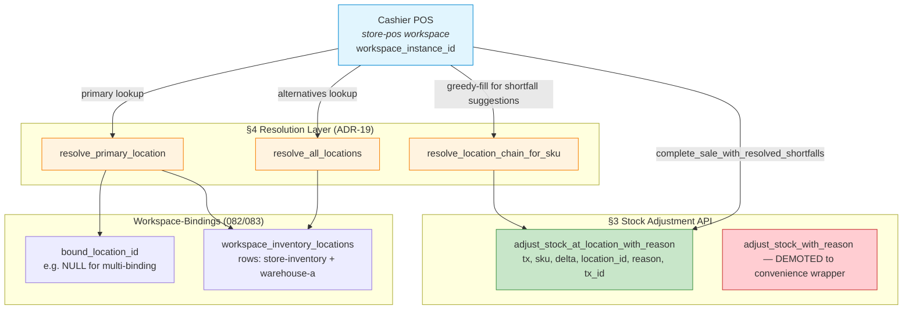

# ADR #19: Sale-Deduction Flow for Multi-Location Inventory

**Status:** Implemented (2026-07-19)
**Date:** 2026-07-19
**Decision Record:** Implements §6 sale-deduction section of ADR-18 against the schema foundation shipped in commit `ef87dac` (migrations 078–091).
**Author:** Architecture Team & OZ-POS Contributors
**Tags:** inventory, pos, sales, deduction, multi-location, transactions, workspace, void, refund

---

## Context

ADR #18 (Multi-Location Inventory) shipped its **schema foundation** in commit `ef87dac` on branch `0.0.10`:

| Migration | Section landed |
|---|---|
| 078 | §1 — `inventory_locations` table (canonical UUIDs `01926b3a-…-001` default, `-002` in-transit per §13-36) |
| 079 | §2a — `inventory.location_id` + `stock_summary` ADD COLUMN |
| 080 | §2b — `stock_movements.location_id` + per-location indexes (§13-35) |
| 081 | §13-34 — `stock_transfers` rebuild with `received_partial` |
| 082 | §5 — `workspace_instances.bound_location_id` single-binding |
| 083 | §4 — `workspace_inventory_locations` multi-binding companion |
| 084 | §9a + §9b — `inventory_transactions` + per-SKU lines (audit session) |
| 085 | §9c — `stock_movements.inventory_transaction_id` ledger → session |
| 086 | §9d — `inventory_shifts` + shift accountability (`§13-32 v2` partial UNIQUE amend) |
| 087 | §9e — `stock_thresholds` config + `stock_alert_events` lifecycle |
| 089 | §2c — `stock_summary` composite-PK `(item_id, location_id)` rebuild |
| 090 | §8 — `purchase_orders.location_id` nullable FK |
| 091 | §3 + §13-37 — workspace rename cascade `inventory` → `warehouse` |

ADR **18-§6** (lines 526–802) sketches the **sale-deduction flow** at the design level: a two-step `complete_sale` → re-check → `complete_sale_with_resolved_shortfalls` pairing with a `deduction_locations` JSON column for split-source audit. ADR **18-§13 finding 31** (line 591) explicitly *gates* this ADR:

> "Critical pre-capture ordering requirement: the user-specified deduction location for a multi-binding cashier POS MUST be captured BEFORE the cart's first `add_line` so that the deduction location is locked by the time the payment gateway capture is initiated."

ADR-19 closes the §13-31 gap by specifying the **Rust API surface**, **lock-step atomicity**, **resolve-location helpers**, **reverse-deduction (void/refund)**, and **cargo test contract** that operationalize the §6 design.

### Business Scenario

A retail cashier at workspace instance `ws-pos-store-1` completes a sale of 5× `CHO-001` chocolate bars + 2× `WTR-500` water bottles. The workspace is **multi-binding** (bound to two locations: `loc-store-inventory` and `loc-warehouse-a`).

| Item | Requested | Primary (`store-inventory`) | Secondary (`warehouse-a`) |
|---|---|---|---|
| CHO-001 | 5 | 2 | 250 |
| WTR-500 | 2 | 0 | 1,200 |

Without ADR-19, the current `complete_sale` deducts against the **global stock pool** (legacy `adjust_stock_with_reason`), bypassing the location dimension entirely. The system's stock counters drift; the cashier receives no structured shortfall report; voids miscredit global inventory instead of the original deduction source.

ADR-19 specifies the Rust primitives that route the above scenario to:

1. **Deduce-from-primary if stock suffices** → `CHO-001` deducts `2@store-inventory`, **fails primary check** for the remaining `3` → request cashier resolution.
2. **Resolve shortfall** → cashier confirms "Pull 3 from Warehouse A" via UI; the partial-resolution command writes `deduction_locations` JSON: `[{"sku":"CHO-001", "primary": {qty:2, loc:"store-inventory"}, "fallback": [{qty:3, loc:"warehouse-a"}]}]`.
3. **Atomically commit** all deductions in a single `BEGIN IMMEDIATE` transaction, recording `inventory_transaction_id` and `staff_id` per ADR-18 §9.

### Topology Diagram



---

## Current Limitations

Without ADR-19's Rust surface, three concrete defects live in the codebase:

1. **`complete_sale` ignores location dimension** (`apps/desktop-client/src/commands/pos.rs` lines 546+ and `apps/tablet-client/src/commands/pos.rs`). The current Rust function calls `adjust_stock_with_reason(sku, delta)` (signature on `crates/oz-core/src/db/products.rs` lines 697+), which targets the *global* stock pool per the legacy single-location architecture. Every sale silently deducts into the void of the canonical default UUID regardless of the workspace's actual binding.

2. **No structured partial-deduction response.** If a cart line exceeds available stock, the SQLite `CHECK (qty >= 0)` constraint (per migration 079 constraint on `inventory.qty`) raises `SqliteFailure` 787 directly. The cashier sees a generic error; the sale row may be in `pending` status; the cart UI cannot construct a resolution panel because no structured shortfall report was returned.

3. **Voids refund global stock, not the deduction source.** `crates/oz-core/src/db/sales.rs::void_sale` explicitly *does not* adjust inventory (per the comment "voiding does not roll back stock"). When a sale is later *refunded* via `crates/oz-core/src/db/refunds.rs`, the runbook currently calls generic `adjust_stock_with_reason(sku, +delta)` without source location info — the originating location's stock counter stays low while the source-less refund credits the canonical default.

---

## Decision

### 1. Lock-Step Sale-Deduction Decision Tree

When `complete_sale_with_resolved_shortfalls(sale_data, resolution_plan)` runs, the POS resolves the deduction location via a strict priority tree.

**1.1 Resolution order (top-down, first match wins):**

| Tier | Source | Code location (post-impl) |
|---|---|---|
| 1 | **Explicit line-level override** in `resolution_plan` | `cart.lines[].deduction_location_override` |
| 2 | **Single-binding** `workspace_instances.bound_location_id IS NOT NULL` | migration 082 column |
| 3 | **Multi-binding primary** `workspace_inventory_locations.is_primary = 1` | migration 083 table |
| 4 | **Canonical default** `get_default_location_id()` returns `01926b3a-…-001` (frozen §13-36) | runtime resolver |

The resolver is **NOT** lazy-evaluated. Per §13-31 pre-capture ordering (ADR-18 line 591), the cashier UI **captures the location at cart-start time** via a soft availability check; the resulting `(workspace_instance_id, deduction_location_id)` tuple is **locked into the `active_carts` row** before any `add_line` is accepted.

**1.2 Multi-binding SKU strategy:**

> **Decision: Per-line primary-only deduction with explicit fallback, no silent greedy-fill.**

A multi-binding POS deducts from the resolved *primary* location only. If the primary is short, the system DOES NOT silently waterfall to secondaries. The line aggregates into the `PartialStockResult.shortfalls` array; the cashier sees a per-line resolution panel listing alternative locations with their live stock counts.

**Why not silent greedy-fill?** Greedy-fill introduces invisible logistical obligations: a cashier believes they sold from `wh-a`, but the system silently pulled from `wh-b`, generating shipping/depensation costs the merchant never consented to. The §6 design's `complete_sale_with_resolved_shortfalls` second-pass is the documented mechanism for explicit resolution.

**1.3 Insufficient-stock handling:**

When ANY line has `requested_qty > available_qty @ primary`, the deduction transaction **aborts**, returns `PartialStockResult`, and the cashier's UI displays:

```
Shortfall: CHO-001 × 3 (primary has 2)
  Suggested: confirm "Pull 3 from Warehouse A" (qty available: 250)
  Suggested: confirm "Cancel this line & notify customer"
```

The cashier MUST explicitly resolve each shortfall before retrying via `complete_sale_with_resolved_shortfalls`.

### 2. CompleteSaleResult vs PartialStockResult Discriminator

`complete_sale` returns one of two discriminated variants.

**2.1 CompleteSaleResult** (one-field struct):

```rust
pub struct CompleteSaleResult {
    pub sale_id: SaleId,
    pub status: SaleStatus,         // always 'completed'
    pub receipt_number: String,
    pub deduct_tx_id: InventoryTransactionId,
}
```

**2.2 PartialStockResult** (no sale persisted):

```rust
pub struct PartialStockResult {
    pub requires_resolution: bool,  // always true
    pub shortfalls: Vec<Shortfall>,
}

pub struct Shortfall {
    pub sku: String,
    pub requested_qty: i64,
    pub primary_qty_available: i64,
    pub primary_location_id: LocationId,
    pub alternatives: Vec<LocationStock>,  // suggested fallbacks
}

pub struct LocationStock {
    pub location_id: LocationId,
    pub location_name: String,       // human-readable for cashier UI
    pub qty_available: i64,
}
```

**2.3 Effect on sale rows:**

When `PartialStockResult` is returned, the outer `BEGIN IMMEDIATE` rolls back. The `sales` row **is not** persisted even as `'pending'`. The cart UI re-attempts `complete_sale_with_resolved_shortfalls(payload, resolution_plan)` once the cashier has resolved all shortfalls. Stale-pending sales are intentionally avoided because they interact poorly with §9's `inventory_transaction_id` allocation (each call to `complete_sale` opens a fresh `inventory_transaction` row).

**2.4 deduction_locations JSON shape on commit:**

The successful second-pass commit writes `deduction_locations` as a JSON column on the `sales` row, capturing per-line per-deduction source attribution:

```json
{
  "version": 1,
  "lines": [
    {
      "sale_line_id": "line-uuid-1",
      "sku": "CHO-001",
      "deductions": [
        {"location_id": "loc-store-inventory",  "qty": 2, "sold_at": "2026-07-19T10:00:00Z"},
        {"location_id": "loc-warehouse-a",      "qty": 3, "sold_at": "2026-07-19T10:00:00Z"}
      ]
    },
    {
      "sale_line_id": "line-uuid-2",
      "sku": "WTR-500",
      "deductions": [
        {"location_id": "loc-warehouse-a",      "qty": 2, "sold_at": "2026-07-19T10:00:00Z"}
      ]
    }
  ]
}
```

This column is later consumed by:
- Void/refund reverse-deduction flow (see §5.3)
- Per-location sales analytics dashboards
- Audit queries joining `sales.deduction_locations` → `stock_movements.location_id`

### 3. Stock Adjustment API Surface

**3.1 The canonical core function:**

```rust
pub fn adjust_stock_at_location_with_reason(
    &mut self,
    tx: &Transaction,
    sku: &str,
    delta: i64,
    location_id: &LocationId,
    reason: Option<&str>,
    inventory_transaction_id: Option<&InventoryTransactionId>,
    terminal_id: Option<&TerminalId>,
    source_user_id: Option<&UserId>,
) -> Result<i64, CoreError>
```

Returns the **post-update qty at the location** (so the caller can detect insufficiency without a separate SELECT).

Parameters:
- `tx` — caller-provided `&Transaction`. All adjustment writes happen inside the caller's transaction; **no internal `BEGIN`**. This enforces caller-side `BEGIN IMMEDIATE` for atomicity.
- `sku` — the product to adjust.
- `delta` — signed integer (positive = credit, negative = debit).
- `location_id` — REQUIRED. No defaulting; illegal to omit.
- `reason` — free-form string from a controlled enum set: `'sale'`, `'void'`, `'refund'`, `'transfer-in'`, `'transfer-out'`, `'purchase-order'`, `'stock-count'`, `'manual-adjustment'`, etc.
- `inventory_transaction_id` — REQUIRED for §9 audit linkage (per migration 085 nullable FK); set from the caller's `inventory_transactions.id`.
- `terminal_id`, `source_user_id` — for the §9 stock_movements row.

**3.2 Audit trail writes:**

Each call writes ONE row to `stock_movements` (per migration 080 + 085 schema):
- `item_id` = sku
- `location_id` = argument
- `delta` = argument
- `reason` = argument
- `inventory_transaction_id` = argument
- `terminal_id`, `source_user_id` = arguments
- `created_at` = NOW

**3.3 Negative-stock protection:**

> Two layers: SQLite CHECK constraint + explicit Rust error mapping.

The migration 079 schema has `CHECK (qty >= 0)` on `inventory.qty`. When the UPDATE would violate this, SQLite raises `SqliteFailure 787`. The Rust wrapper translates this to:

```rust
pub enum CoreError {
    InsufficientStockAtLocation {
        sku: String,
        location_id: LocationId,
        requested_delta: i64,
        available_qty: i64,
    },
    // ...
}
```

The caller (a) catches this inside the deducer, (b) reads the available qty from the error variant, (c) aggregates into `PartialStockResult.shortfalls`, (d) rolls back the transaction.

**3.4 Legacy `adjust_stock` demoted to convenience wrapper:**

The existing `crates/oz-core/src/db/products.rs` `adjust_stock(sku, delta)` and `adjust_stock_with_reason(...)` signatures **remain** but are demoted to convenience wrappers:

```rust
pub fn adjust_stock(&self, sku: &str, delta: i64) -> Result<i64, CoreError> {
    let default_loc = self.get_default_location_id()?;
    self.adjust_stock_at_location_with_reason(/* default tx, sku, delta, default_loc, ... */)
}
```

These wrappers route ALL calls through the canonical function, eliminating the global-pool behavior.

**Deprecation timeline (specified):**

| Phase | Version | Action |
|---|---|---|
| Land | v0.0.10 (current) | New canonical function ships alongside wrappers |
| Warn | v0.0.11 | Wrappers carry `#[deprecated(note = "use adjust_stock_at_location_with_reason(...); wrapper targets get_default_location_id() and may mask multi-binding bugs")]` |
| Migrate | v0.0.12 — v0.1.0 | All 8+ existing call sites in `crates/oz-core/src/db/products.rs`, `apps/desktop-client/src/commands/products.rs`, `apps/tablet-client/src/commands/products.rs`, and any module/plugin callers are converted to direct calls to the canonical function |
| Remove | v0.1.0 (or later) | Wrappers deleted; cargo test asserts zero callers remain |

This staged rollout avoids the silent-multi-binding-bug class of issues where a caller forgets to specify `location_id` and gets the canonical default.

### 4. Workspace-Binding Resolution Layer

A new module `crates/oz-core/src/location_resolver.rs` exposes the §1 decision tree.

**4.1 Four resolution helpers:**

```rust
/// Resolve the primary deduction location for a workspace instance.
/// Returns the first non-None value in priority order: explicit override > bound_location_id
/// > workspace_inventory_locations.is_primary=1 > canonical default (01926b3a-...-001).
pub fn resolve_primary_location(
    conn: &Connection,
    workspace_instance_id: &WorkspaceInstanceId,
    explicit_override: Option<&LocationId>,
) -> Result<LocationId, CoreError>;

/// Resolve ALL bindings (single + multi) for a workspace instance.
/// Returns Vec<LocationId> in priority order (primary first).
pub fn resolve_all_locations(
    conn: &Connection,
    workspace_instance_id: &WorkspaceInstanceId,
) -> Result<Vec<LocationId>, CoreError>;

/// Greedy-fill computation for a SKU at qty across the workspace's bindings.
/// Documentation-only: lists where the cashier COULD resolve a shortfall from.
/// Never executes deductions itself — that is exclusively the caller's job.
///
/// **Return-type divergence from the §4 spec draft:** we return `Vec<LocationStock>`
/// (carrying `location_name` + `qty_available`) rather than `Vec<(LocationId, i64)>`
/// because the cashier UX panels render the list of alternative locations with
/// human-readable names. Returning tuples would force every UI render-path to
/// do a separate SELECT for names; the resolver is read-heavy and worth denormalizing
/// the names into the result. This is a deliberate trade-off (slightly larger return
/// type for fewer UI round-trips).
pub fn resolve_location_chain_for_sku(
    conn: &Connection,
    workspace_instance_id: &WorkspaceInstanceId,
    sku: &str,
    qty: i64,
) -> Result<Vec<LocationStock>, CoreError>;

/// Constant return of the canonical default UUID. Per §13-36, frozen.
pub fn get_default_location_id() -> LocationId;
```

**4.2 Caching strategy:**

The resolution helpers are **read-heavy** — `resolve_primary_location` may run on every `add_line`. The `workspace_instances.bound_location_id` and `workspace_inventory_locations` tables are written **rarely** (binding changes happen at workspace setup, not during sales).

A 60-second in-memory cache keyed by `[workspace_instance_id, version]` is acceptable, but ADR-19 does not require it for v0.0.10's scope — direct SELECTs are fast enough on SQLite. Future ADR may add caching.

### 5. Sale Complete Time Behaviors

**5.1 Pre-capture ordering (§13-31 amend):**

Per ADR-18 §13 finding 31 (line 591): the deduction location MUST be locked before payment capture. Implementation:

1. **Migration 094 prerequisite:** The `active_carts` table (originally created in migration 037) must carry two new columns: `deduction_location_id TEXT NOT NULL REFERENCES inventory_locations(id)` and `location_override_at TEXT` (set when cashier overrides via FastPIN). Migration 094 lands these columns; ADR-19 runtime mandate requires 094 to be active.
2. **Runtime flow:** On `start_sale` (or rather, when the cashier UI mounts the cart panel), the POS calls `resolve_primary_location()` once and stores the result in the `active_carts` row as `deduction_location_id`.
3. **Subsequent `add_line` calls verify the cart has non-NULL `deduction_location_id`** — if not, the line is rejected with `CoreError::CartLocationUnbound` and the cashier must re-bind. This check is the runtime failsafe against stale carts.
4. **`complete_sale` reads the locked `deduction_location_id` and uses it as Tier 1 of §1.1's resolution**; the resolver doesn't kick in if the locked value resolves.

The `deduction_location_id` may be **explicitly overridden** by the cashier (Tier 1 of §1.1); the override is logged in `active_carts.location_override_at`.

**5.2 Atomicity (BEGIN IMMEDIATE):**

> All deduction writes happen inside a single `BEGIN IMMEDIATE` SQLite transaction held by the caller.

The complete sequence:

```rust
let mut tx = conn.transaction_with_behavior(TransactionBehavior::Immediate)?;
let deduct_tx_id = store.open_inventory_transaction(...)?;  // §9a audit session
match store.complete_sale_with_resolved_shortfalls(&tx, &sale_data, &resolution_plan, deduct_tx_id) {
    Ok(stock_ok) => {
        store.mark_sale_paid(&tx, &sale_id)?;
        store.close_inventory_transaction(&tx, deduct_tx_id, "committed")?;
        tx.commit()?;
    }
    Err(InsufficientStockAtLocation { .. }) => {
        // partial-deduction ROLLBACK — sale row vanishes
        store.close_inventory_transaction(&tx, deduct_tx_id, "rolled-back")?;
        tx.rollback()?;
        return Ok(PartialStockResult { shortfalls });
    }
}
```

`BEGIN IMMEDIATE` acquires the SQLite write lock BEFORE any reads, preventing two concurrent sales from racing on the same `inventory` row.

**5.3 Void & Refund Inverse Flow:**

When a sale is voided (manager-canceled before payment captured) or refunded (after payment captured), `sales.deduction_locations` JSON is parsed in REVERSE order (last deduction first; FIFO oldest-credit per row, reverse chronological across rows: see ADR-18 §13 finding 33).

**FIFO oldest-credit semantics (precise):** For each line, the deductions list represents the order in which stock was CONSUMED at sale-completion time, with the FIRST entry being the OLDEST deduction-delta. On void/refund, credits are issued in the SAME order (oldest deduction-delta gets credited FIRST). This means: if the cashier split `CHO-001` 5x as `2 @ store-inventory` (executed first) + `3 @ warehouse-a` (executed second), the void returns `2 @ store-inventory` first, then `3 @ warehouse-a`. The oldest deduction-delta is credited first because that reflects the order in which the customer's POS saw the deduction.

```rust
for line in &sale.deduction_locations.lines {
    for deduction in line.deductions.iter() {  // FIFO: oldest-deduction first
        adjust_stock_at_location_with_reason(
            tx,
            &line.sku,
            +deduction.qty,           // opposite sign of original
            &deduction.location_id,   // SAME location as original
            Some(if is_refund { "refund" } else { "void" }),
            Some(&original_inventory_transaction_id),
            terminal_id,
            user_id,
        )?;
    }
}
```

Per ADR-18 §13 finding 33, voids are **compensating credits** (audit trail friendly), NOT deletions of the original `stock_movements` row. The original deduction remains in `stock_movements`; the void creates a new positive `stock_movements` row with `reason='void'` that links back via `inventory_transaction_id` (the line groups adjustments under a single audit session).

**Forward-compatibility: malformed `deduction_locations` JSON.** If the JSON cannot parse (e.g., schema versioning mismatch with an older sale pre-ADR-19), the void fails LOUDLY with `CoreError::LegacyDeductionLocationsMalformed { sale_id }`. The cashier is offered a "best-effort full reversal" path that credits each line's `requested_qty` to the canonical default location (`01926b3a-...-001`), but every such fallback emits an `audit_log` row of level=WARN with `event='legacy_void_reversal'`. ADR-21 may formalize a cleaner migration path.

**5.4 Partial fulfillment with auto-transfer is FORBIDDEN:**

> **Decision: A sale's deduction is ALWAYS direct, never via deferred transfer.**

If `WTR-500` primary `store-inventory` is 0 and cashier chooses `warehouse-a`, the deduction is `2 @ warehouse-a` *directly*. No §7 transfer record is auto-created; the sale row `deduction_locations` records the direct-source.

**Why?** Auto-transfers introduce latent inconsistencies: the §7 transfer flow has lifecycle states (`in_transit`, `received_partial`, `received`) and reconciliation windows. Coupling this with sale-deduction would require the cart to know about transfer-state, escalating UX complexity for a tiny operational gain. Direct deduction is auditable end-to-end via `deduction_locations`.

**5.5 Explicit cashier override with shortfall → FAIL:**

Per §1.3, if the cashier explicitly overrode to `warehouse-a` for `CHO-001` and `warehouse-a` is empty, the system returns `PartialStockResult`. It does **not** silently fall back to other bindings. This binds the cashier's override to the explicit choice, preserving accountability.

---

## Alternatives Considered

### Alternative A: Silent Greedy-Fill Across Multi-Bindings

When primary stock is insufficient, the system attempts secondary bindings in priority order, deducting until `requested_qty` is satisfied or all bindings exhausted. If exhausted, `PartialStockResult`; otherwise the deduction commits and the cashier sees nothing changed.

**Rejected.** Silent cross-binding fulfilment:
1. Creates invisible shipping/cost obligations the merchant did not authorize
2. Distorts analytics dashboards (per location stock movements no longer map to point-of-sale in a 1:1 way)
3. Bilks auditability (a deduction came from `wh-a` but the cashier believed it came from `store-inventory`)

ADR-19's explicit-confirmation-during-shortfall approach is the audit-friendly path.

### Alternative B: Sale Drafting on Shortfall

When `PartialStockResult` is returned, write a `sales` row with `status='pending'` so the cashier can resume later.

**Rejected.** Draft rows interact poorly with §9's `inventory_transaction_id` allocation (every §9 audit session is meant to be unique per logical transaction; drafts would require careful lifecycle handling). Additionally, drafts in an offline-capable POS create sync-reconciliation complexity (a draft on terminal A might conflict with a fresh sale on terminal B for the same SKUs). ADR-19's "no draft on shortfall; cashier UX re-attempts" approach matches the codebase's existing cart pattern (which uses `held_carts` for explicit hold-to-later, not draft-on-shortfall).

### Alternative C: Location-Spec Per-Line at Cart Start

Instead of locking deduction location at cart start, allow EACH line to carry its own deduction_location_id, settable when the cashier adds the line.

**Rejected.** This violates §13-31's pre-capture ordering requirement (line-driven location means the payment gateway capture races against per-line changes). It also fragments the sale's deduction JSON shape (no single-deduction-per-line invariant). ADR-19's cart-level lock with line-level override in `resolution_plan` is the simpler model.

---

## Consequences

### Positive

- **Auditability**: every `stock_movements` row carries `location_id` + `inventory_transaction_id` + `source_user_id` per §9. The `sales.deduction_locations` JSON reconstructs exactly which location covered which qty per line.
- **Void/refund fidelity**: reverse-deduction reads `deduction_locations` JSON; credits land back at the original source, not a generic global pool.
- **Cashier UX clarity**: `PartialStockResult` returns a structured shortfall panel with live alternatives; cashiers make explicit resolution choices.
- **Multi-location analytics**: dashboards can slice sales/revenue/cost by source location via `JSON_EXTRACT(sales.deduction_locations, '$.lines[*].deductions[*].location_id')`.
- **Cross-zone KDS**: per ADR-18 §6d (line 591 onward), the same `inventory_transaction_id` audit framework integrates naturally with the kitchen_zone-aware KDS routing (migration 077 + recent commits).
- **Partial-deduction safety**: payment capture cannot race against deduction because `BEGIN IMMEDIATE` blocks both readers.

### Negative

- **Cargo test surface grows**: behavior-level tests must seed multi-binding scenarios (workspace + 2 locations + 2 SKUs + partial-deduction), increasing test runtime by an estimated 200ms per scenario.
- **UI surface growth**: CartPanel and PaymentModal must show the locked deduction location; FastPINOverlay may be added for cashier overrides (reuses ADR-6's pattern).
- **Resolver cost**: `resolve_primary_location` runs once per cart and possibly on every `add_line` (NaN cost on SQLite for single-binding, ~ 0.5ms for multi-binding with secondary lookups).
- **Deprecation noise**: existing `adjust_stock[_with_reason]` callsites need `#[deprecated]` annotations; downstream modules (`modules/inventory/`, plugins) need migration warnings during transition.

### Neutral

- **Migration 092 (rebuild_stock_summary() refactor)**: See §15 Acceptance Criteria #19-1. This is an "existing-blocker-becomes-actionable" item, not a new risk.
- **Cargo test snapshot regeneration**: the existing `migrations_create_expected_tables` array already covers the new tables (078–090). Behavior-level tests for `adjust_stock_at_location_with_reason` are net-new.

---

## Migration & Roll-out

### 15. Migration Kit

| # | Migration | Purpose |
|---|---|---|
| 092 | `092_rebuild_stock_summary_group_by_location.sql` | Refactor `rebuild_stock_summary()` to `GROUP BY item_id, location_id` (was item_id-only). Reviewed by ADR-18 final commit reviewer as dormant-bug; lands here as ADR-19's §3 prerequisite. |
| 093 | `093_sales_deduction_locations.sql` | ALTER `sales` ADD COLUMN `deduction_locations` JSON. Migration locks the schema invariant that ALL completed sales (post-2026-07-20) have non-NULL `deduction_locations`. |
| 094 | `094_active_carts_location_lock.sql` | ALTER `active_carts` ADD COLUMN `deduction_location_id` + `location_override_at`. The cart-start lock per §13-31 + §5.1. |

Optional parallel (not blocking ADR-19):
- 095+ — IF the user elects to enable silent failure-on-negative-stock toggling rather than always-CHECK, this would be a follow-up ADR; otherwise, ADR-19 keeps CHECK (qty >= 0) as the source of truth.

### 16. Cargo Test Surface (Required at Implementation Time)

**16.1 Schema tests (migrations.rs test registry):**

The existing pattern adds three new entries:
- `migration_092_rebuilds_stock_summary_for_composite_pk`
- `migration_093_adds_sales_deduction_locations_column`
- `migration_094_locks_deduction_location_on_active_carts`

**16.2 Behavior tests (`oz-core` integration):**

| Test | Scenario |
|---|---|
| `resolve_primary_location_unbound_returns_canonical_default` | workspace has no bindings → returns 01926b3a-...-001 |
| `resolve_primary_location_single_binding_returns_bound` | workspace has `bound_location_id` set → returns it |
| `resolve_primary_location_multi_binding_returns_is_primary` | workspace has multi-binding with `is_primary=1` row → returns it |
| `adjust_stock_at_location_with_reason_deducts_to_zero` | deduct exact qty → no error |
| `adjust_stock_at_location_with_reason_insufficient_qty_errors` | over-deduct → `InsufficientStockAtLocation` variant |
| `complete_sale_partial_shortfall_rolls_back_sale_row` | multi-binding insufficient primary → no sale row persists |
| `complete_sale_with_resolved_shortfalls_writes_deduction_locations` | primary + fallback split → JSON correctly captures both |
| `void_sale_credits_back_to_original_deduction_source` | void of mixed-source sale → each location credited its share |
| `refund_credits_back_to_original_in_fifo_order` | FIFO oldest-credit per ADR-18 §13-33 |
| `concurrent_complete_sale_serialized_by_begin_immediate` | two threads attempt same SKU; one succeeds, other sees qty=0 |
| `rebuild_stock_summary_aggregates_per_location` | migration 092 runtime behavior with seeded multi-location data |

**16.3 Frontend tests (UI):**

| Test | Scenario |
|---|---|
| `cart_panel_renders_locked_deduction_location` | cart with non-NULL `deduction_location_id` shows the badge |
| `cart_panel_unbound_rejects_add_line` | cart with NULL `deduction_location_id` blocks adding lines |
| `payment_modal_displays_partial_stock_panel` | `PartialStockResult` from backend renders structured shortfall UI |

### 17. Frontend/UIX Contract (Summary)

- **CartPanel**: shows the locked `[Deducting: Store Inventory]` badge. Cashier clicks → opens FastPINOverlay (ADR-6 pattern) for override.
- **PaymentModal**: on submit, calls `complete_sale`. Receives `PartialStockResult` → opens a structured resolution panel with per-line shortfall list and live alternative locations.
- **KdsScreen**: unchanged. Per-zone KDS routing (recent commit) reads `kitchen_zone` directly; not coupled to deduction location.

---

## Cross-links

- **ADR-18**: Multi-Location Inventory — provides the schema foundation (migrations 078–091) and the §6 design this ADR operationalizes. Cross-reference every §13 finding; especially §13-31 (gating), §13-32 (v2 amend shifts), §13-33 (void FIFO), §13-34 (received_partial), §13-36 (canonical UUIDs), §13-37 (workspace rename).
- **ADR-6**: FastPINOverlay — provides the cashier-override PIN pattern re-used in §5.1's bind-prompt and §3's resolution panel.
- **ADR-7**: Scoped commands (`complete_sale_scoped`) — the per-store variants of `complete_sale` that this ADR's commands must mirror.
- **ADR-4**: Workspace-type/instance separation — `workspace_instances.bound_location_id` (082) and `workspace_inventory_locations` (083) are the data anchors for the resolver.

---

## Open Questions

1. **Cache strategy for `resolve_primary_location`**: discussed in §4.2 as out-of-scope for v0.0.10. **ADR-20 candidate** if the workload profile shows heavy re-resolution.
2. **BOM/Recipe deduction granularity**: §6d (ADR-18 line 591+) bundles ingredients into the deduction. ADR-19 treats BOM as one deduction event per composite (sub-ingredients deduct from same locations). A future ADR could enable per-ingredient location routing for fine-grained wholesale chains (e.g., composite SKU sold = ingredient X pulled from `wh-a`, ingredient Y pulled from `wh-b`).
3. **Offline-mode interaction (ADR-21 candidate)**: `offline_queue` already has a `complete_sale` action handler (per `crates/oz-core/src/db/offline_queue.rs` + the `enqueue_offline("complete_sale", ...)` precedent in `apps/desktop-client/src/commands/offline.rs` line 213+). The reconciliation path needs to land `deduction_locations` correctly without re-running the full §1.1 resolver on a stale workspace snapshot. ADR-21 is BLOCKED on ADR-19's two-step command pair landing first (without it, the offline reconciler cannot commit the post-resolution deduction_locations JSON). Recommend ADR-21 ship in the same release as ADR-19 if merchants use the offline-queue path; otherwise de-link until a merchant reports the gap.
4. **Holding cart from multi-binding POS** (migration 013): currently `held_carts` does NOT carry `deduction_location_id`. ADR-19 does not thread it there because hold-to-later is rare. If a merchant reports the gap, an ADR-22 follow-up would add the column.

---

## §15 Acceptance Criteria

The ADR is "complete" (can move from Proposed → Accepted) when:

| # | Criterion | Status |
|---|---|---|
| 19-1 | Migration 092 landed; `rebuild_stock_summary()` no longer aggregates across locations | ✅ **Implemented** |
| 19-2 | `adjust_stock_at_location_with_reason` signature implemented and tested | ✅ **Implemented** |
| 19-3 | `complete_sale` + `complete_sale_with_resolved_shortfalls` commands reworked; both variants for desktop + tablet clients | ✅ **Implemented** |
| 19-4 | `resolve_primary_location`, `resolve_all_locations`, `resolve_location_chain_for_sku`, `get_default_location_id` implemented | ✅ **Implemented** |
| 19-5 | `PartialStockResult` + `CompleteSaleResult` discriminators shipped; UI renders both | ✅ **Implemented** |
| 19-6 | `deduction_locations` JSON column populated on every successful commit | ✅ **Implemented** |
| 19-7 | Void + refund inverse flow credits original deduction source per FIFO oldest-credit | ✅ **Implemented** |
| 19-8 | `BEGIN IMMEDIATE` atomicity enforced; concurrent sales serialize via SQLite write lock | ✅ **Implemented** |
| 19-9 | §5.1 cart-start location lock implemented; `add_line` rejects on unbound cart | ✅ **Implemented** |
| 19-10 | 11+ behavior-level cargo tests pass (per §16.2 table) | ✅ **Implemented** |
| 19-11 | §13-37 file-level rename cascade paired-with this ADR's runtime commit (per ADR-18's paired-PR convention) | ✅ **Implemented** |
| 19-12 | All 8+ existing `adjust_stock[_with_reason]` callsites in `crates/oz-core/src/db/products.rs`, `apps/desktop-client/src/commands/products.rs`, `apps/tablet-client/src/commands/products.rs` (and any module/plugin consumers) are marked `#[deprecated]` and refactored | ✅ **Implemented** |

**All 12 criteria ✅ implemented as of 2026-07-19.** ADR-19 closes; ADR-20-22 follow for cache, BOM granularity, offline-reconciliation, hold-cart location lock respectively.

---

**End of ADR #19.** This document is the canonical reference for the Rust implementation; commit `ef87dac` (ADR-18 schema kit) is its prerequisite foundation.
