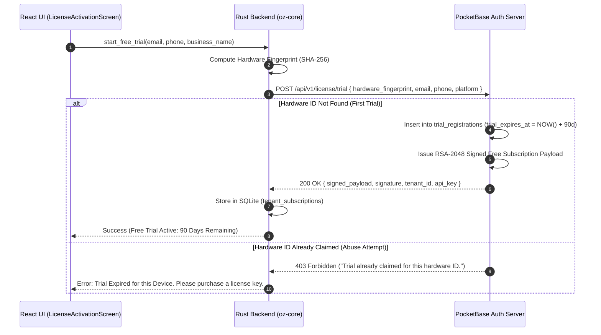

# ADR #23: Free Trial Lifecycle & License Activation Workflow

- **Status**: Approved
- **Date**: 2026-07-20
- **Author**: Technical Architecture & Security Team
- **Related Documents**:
  - `docs/decisions/2026-07-10-license-server.md` (ADR #9: License Server Architecture)
  - `docs/decisions/2026-07-10-subscription-tier-entitlement.md` (ADR #18: Tier Entitlements)
  - `docs/specs/hardware-fingerprint-trial-lock.md` (`SPEC-2026-TRIAL-LOCK`: Anti-Abuse Trial Lock)

---

## 1. Context and Problem Statement

OZ-POS provides a **90-day Free Trial** for new merchants to test POS, register checkout, store management, and inventory features without requiring an upfront credit card or license key.

However, to support commercial viability and prevent trial abuse (e.g., users repeatedly reinstalling the software or clearing local storage to reset trial timers), the system requires:
1. A **hardware-bound trial lock** enforced by the PocketBase Auth Server.
2. A clear **trial expiration & offline grace period lifecycle**.
3. A seamless, **zero-data-loss license upgrade & activation flow** when a trial ends or when a user purchases a commercial license key (`1-Time`, `Standard`, `Pro`, `Enterprise`).

---

## 2. Decision Summary

We adopt a 4-phase trial lifecycle with server-authoritative hardware fingerprinting, a 14-day offline grace period, soft app locking on grace expiration, and instant in-app license key activation with zero data loss.

### 2.1 Trial Lifecycle Timeline

```
Day 1 ────────────────────────► Day 76 ─────────────► Day 90 ─────────────► Day 104+
 Full 90-Day Free Trial       14-Day Warning Banner   Trial Expiration      Grace Period Ends
 (1 Store, 1 Register)        "Expires in X days"     (14-Day Grace Starts) (Soft Lock Screen)
```

| Phase | Time Window | Operating Status | User Impact & UI Surface |
| :--- | :--- | :--- | :--- |
| **1. Active Trial** | Days 1 – 76 | Full Operational Access | Full access to 1 Store Profile, 1 POS Instance, 1 Warehouse. |
| **2. Expiry Warning** | Days 76 – 90 | Full Operational Access | Top reminder banner: `⚠️ Your Free Trial expires in X days. [ Upgrade License ]`. |
| **3. Offline Grace** | Days 90 – 104 | Full Operational Access | 14-day grace period. Checkout never stops abruptly. Banner: `⚠️ Trial Expired — 14-Day Grace Active. [ Enter Key ]`. |
| **4. Grace Expired** | Day 104+ | Soft App Lock Screen | Operational workspace locked. Lock screen displays: Enter Key, Buy Key Online, or Export Data Backup. |

---

## 3. Detailed Workflow Specifications

### 3.1 Initial Free Trial Activation Flow

When an unactivated POS instance boots for the first time:



### 3.2 Trial Expiration & Soft Lock Screen Behavior

When the trial and 14-day grace period expire (Day 104+):
1. **Workspace Lock**: POS operations (checkout, sale creation, inventory adjustments) are gated behind the **License Upgrade Overlay**.
2. **Data Safety Guarantee**:
   - SQLite databases, sales history, customer records, inventory, and settings **remain 100% safe and untouched**.
   - No records are ever deleted upon trial expiration.
3. **Lock Screen Options**:
   - **`🔑 Enter License Key`**: Input field for license key (`OZ-STD-...`, `OZ-PRO-...`).
   - **`🛒 Buy License Online`**: Opens browser link / QR code to `https://ozpos.com/buy`.
   - **`💾 Export Local Backup`**: Allows exporting local encrypted SQLite database backup.

### 3.3 License Upgrade & Activation Flow

When a merchant enters a purchased license key:

1. **Request**: POS sends `POST /api/v1/license/activate` with `{ key, email, phone, machine_id, api_key }`.
2. **Server Validation**:
   - PocketBase validates key validity, status (`unused`), and tenant ownership.
   - Upgrades tenant tier from `Free` to `OneTime`, `Standard`, `Pro`, or `Enterprise`.
   - Issues a new signed RSA payload with updated quotas (`max_stores`, `max_pos_instances`).
3. **Instant In-Memory & Local Database Update**:
   - `oz-core` validates the RSA public key signature.
   - Updates `tenant_subscriptions` row in SQLite.
   - Triggers `SCOPED_EVENT_BUS` event `license.updated`.
   - **Instant Unlock**: The lock overlay unmounts immediately without requiring an application restart.

---

## 4. Consequences and Compliance

### 4.1 Positive Impact
- **Zero Friction Onboarding**: Merchants can evaluate OZ-POS for 90 days without payment details.
- **Hardware Abuse Anti-Lock**: Prevents trial reset abuse via reinstallation using OS hardware fingerprinting (`SPEC-2026-TRIAL-LOCK`).
- **Store Continuity**: Store checkout never crashes or locks abruptly during operating hours due to the 14-day offline grace period.
- **Seamless Upgrade**: Upgrading from Trial to Standard/Pro takes < 2 seconds and preserves all historical store data.

### 4.2 Security & Compliance Requirements
- Offline signature verification using embedded 2048-bit RSA public key (`LICENSE_PUBLIC_KEY_PEM`).
- System clock rollback protection via SQLite ledger timestamps.
- Audit logging of all trial activation attempts on the PocketBase Auth Server.
