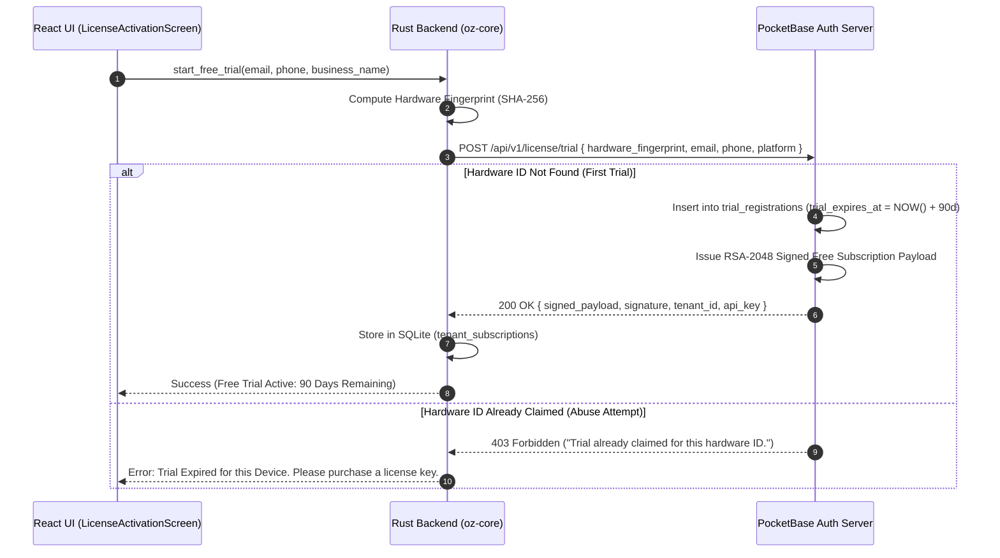

# ADR #23: Free Trial Lifecycle & License Activation Workflow

- **Status**: Approved — ⚠️ **RE-SCOPED by `subscription-tiers.md` §4 (FINAL, approved 2026-08-17)**
- **Date**: 2026-07-20
- **Author**: Technical Architecture & Security Team
- **Related Documents**:
  - `docs/decisions/2026-07-10-license-server.md` (ADR #9: License Server Architecture)
  - `docs/decisions/2026-07-10-subscription-tier-entitlement.md` (ADR #5: Tier Entitlements)
  - `docs/specs/hardware-fingerprint-trial-lock.md` (`SPEC-2026-TRIAL-LOCK`: Anti-Abuse Trial Lock)
  - `subscription-tiers.md` §4 (trial & conversion strategy — the replacement)

> **Re-scope note:** the flat **90-day full-product trial** described below is
> superseded by `subscription-tiers.md` §4: the
> Free tier is **free forever** (1 store / 1 register / 1 warehouse / 3-month
> sales history), and paid trials are **segmented by signup vertical** —
> 14-day Plus trial for general signups, 14-day Pro trial for
> restaurant/cafe signups, 30-day Pro trial for enterprise referrals.
> `TODO.md` C2.1 tracked the implementation (license-server `trial_vertical`
> field + segmented minting, shipped 2026-08-18).
>
> **Deviation 1 (shipped 2026-08-18, then SUPERSEDED):** an earlier version
> of this note recorded the hardware-fingerprint trial lock (§3.1,
> `SPEC-2026-TRIAL-LOCK`) as unimplemented. That deviation is now closed —
> see Deviation 3 below, which documents what actually shipped.
>
> **Deviation 2 (shipped, verified against the code):** the Paddle webhook's
> `custom_data` contract mirrors the Midtrans custom-field contract (ADR #39
> note 2) — the register-first checkout embeds **`email`** (the account email
> the webhook upserts the tenant by, `paddle_webhook.go`
> `resolvePaddleEmail`) and, from C3.2, **`bundle`** (cross-checked against
> the price map's bundle segment, never trusted alone); `phone` may ride
> along when the Paddle checkout collects it. The signup **vertical is not
> carried** on Paddle purchases — trial segmentation is a desktop-activation
> concern (`trial_vertical`, see the segmented-minting note above), the same
> decision ADR #39 made for Midtrans.
>
> **Deviation 3 (shipped 2026-08-18, verified against the code):** the
> hardware-fingerprint trial lock now ships end-to-end:
>
> - **Server** — the `trial_registrations` collection (pb_schema.json,
>   keyed by `hardware_fingerprint` with a unique index, plus the
>   idempotent `ensureTrialRegistrations` migration for existing
>   deployments); `POST /api/v1/license/trial` (`trial.go`) registers a
>   device's first claim and answers **403 `TRIAL_ALREADY_CLAIMED`** on
>   every later attempt, permanently; and the activation-time gate
>   `enforceTrialLock` (`activate.go`) fires **before** the machine-count
>   checks at mint time for trial keys, so a client that skips the endpoint
>   is still locked. Same-tenant re-activations (re-install) pass; a
>   different tenant on the same hardware is the reset-abuse case and gets
>   the 403.
> - **Client** — the desktop app computes the device-level fingerprint
>   `hw_` + SHA-256 of the same hardware anchor `machine_id` derives from
>   (Windows MachineGuid / motherboard UUID via wmic, `/etc/machine-id` on
>   Linux/macOS) via `get_hardware_fingerprint()` (`license.rs`) and sends
>   it on `/api/v1/license/activate` (`hardware_fingerprint` field,
>   `ActivateLicenseRequest`). Unlike `machine_id` (truncated to 15 chars,
>   persisted per-installation), the fingerprint is the full digest in the
>   spec's canonical form, so a wiped Settings table still yields the same
>   value on the same device.
> - **Trust boundary preserved** — the lock fires only for **trial keys**;
>   paid keys are never gated (a paying customer is never locked out by the
>   trial gate). The server also accepts the 15-char `machine_id` form when
>   no `hw_` fingerprint is sent, so legacy clients degrade to the old
>   per-installation identifier rather than bricking activation.
> - **Remaining gaps (accepted):** a host with no queryable hardware anchor
>   (e.g. a minimal container) falls back to a random UUID that is stable
>   only within a process; and the claim is permanent by design — even an
>   expired trial keeps the device claimed, which is the intended anti-reset
>   property but means a device can never be re-trialled (the spec's
>   `trial_registrations` collection matches this). The earlier "nothing
>   stops one device from re-trialling under a fresh email" gap is closed
>   for devices with a stable hardware anchor.
>
> **Deviation 4 (shipped 2026-08-18, verified against the code):** the
> Paddle webhook's `PADDLE_PRICE_TIERS` format was extended from
> `price_id:tier_key[:bundle_id]` to `price_id:tier_key:period[:bundle_id]`
> (period = "month" or "year") to mirror the Midtrans
> `custom_field3` period cross-check (ADR #39 Deviation 3). The webhook
> now cross-checks `billing_cycle.interval` against the price-map period
> so a tampered interval can't drift the expiry cadence. Backward
> compatibility: 2-part entries without a period default to "year".

---

## 1. Context and Problem Statement

OZ-POS provides a **90-day Free Trial** for new merchants to test POS, register checkout, store management, and inventory features without requiring an upfront credit card or license key.

However, to support commercial viability and prevent trial abuse (e.g., users repeatedly reinstalling the software or clearing local storage to reset trial timers), the system requires:
1. A **hardware-bound trial lock** enforced by the PocketBase Auth Server.
2. A clear **trial expiration & offline grace period lifecycle**.
3. A seamless, **zero-data-loss license upgrade & activation flow** when a trial ends or when a user purchases a commercial license key (`1-Time`, `Standard`, `Pro`, `Enterprise`).

---

## 2. Decision Summary

We adopt a 4-phase trial lifecycle with server-authoritative hardware fingerprinting, a 14-day offline grace period, soft app locking on grace expiration, and instant in-app license key activation with zero data loss.

### 2.1 Trial Lifecycle Timeline

```
Day 1 ────────────────────────► Day 76 ─────────────► Day 90 ─────────────► Day 104+
 Full 90-Day Free Trial       14-Day Warning Banner   Trial Expiration      Grace Period Ends
 (1 Store, 1 Register)        "Expires in X days"     (14-Day Grace Starts) (Soft Lock Screen)
```

| Phase | Time Window | Operating Status | User Impact & UI Surface |
| :--- | :--- | :--- | :--- |
| **1. Active Trial** | Days 1 – 76 | Full Operational Access | Full access to 1 Store Profile, 1 POS Instance, 1 Warehouse. |
| **2. Expiry Warning** | Days 76 – 90 | Full Operational Access | Top reminder banner: `⚠️ Your Free Trial expires in X days. [ Upgrade License ]`. |
| **3. Offline Grace** | Days 90 – 104 | Full Operational Access | 14-day grace period. Checkout never stops abruptly. Banner: `⚠️ Trial Expired — 14-Day Grace Active. [ Enter Key ]`. |
| **4. Grace Expired** | Day 104+ | Soft App Lock Screen | Operational workspace locked. Lock screen displays: Enter Key, Buy Key Online, or Export Data Backup. |

---

## 3. Detailed Workflow Specifications

### 3.1 Initial Free Trial Activation Flow

When an unactivated POS instance boots for the first time:


```mermaid
sequenceDiagram
    autonumber
    participant UI as React UI (LicenseActivationScreen)
    participant Core as Rust Backend (oz-core)
    participant Auth as PocketBase Auth Server

    UI->>Core: start_free_trial(email, phone, business_name)
    Core->>Core: Compute Hardware Fingerprint (SHA-256)
    Core->>Auth: POST /api/v1/license/trial { hardware_fingerprint, email, phone, platform }
    alt Hardware ID Not Found (First Trial)
        Auth->>Auth: Insert into trial_registrations (trial_expires_at = NOW() + 90d)
        Auth->>Auth: Issue RSA-2048 Signed Free Subscription Payload
        Auth-->>Core: 200 OK { signed_payload, signature, tenant_id, api_key }
        Core->>Core: Store in SQLite (tenant_subscriptions)
        Core-->>UI: Success (Free Trial Active: 90 Days Remaining)
    else Hardware ID Already Claimed (Abuse Attempt)
        Auth-->>Core: 403 Forbidden ("Trial already claimed for this hardware ID.")
        Core-->>UI: Error: Trial Expired for this Device. Please purchase a license key.
    end
```

### 3.2 Trial Expiration & Soft Lock Screen Behavior

When the trial and 14-day grace period expire (Day 104+):
1. **Workspace Lock**: POS operations (checkout, sale creation, inventory adjustments) are gated behind the **License Upgrade Overlay**.
2. **Data Safety Guarantee**:
   - SQLite databases, sales history, customer records, inventory, and settings **remain 100% safe and untouched**.
   - No records are ever deleted upon trial expiration.
3. **Lock Screen Options**:
   - **`🔑 Enter License Key`**: Input field for license key (`OZ-STD-...`, `OZ-PRO-...`).
   - **`🛒 Buy License Online`**: Opens browser link / QR code to `https://ozpos.com/buy`.
   - **`💾 Export Local Backup`**: Allows exporting local encrypted SQLite database backup.

### 3.3 License Upgrade & Activation Flow

When a merchant enters a purchased license key:

1. **Request**: POS sends `POST /api/v1/license/activate` with `{ key, email, phone, machine_id, api_key }`.
2. **Server Validation**:
   - PocketBase validates key validity, status (`unused`), and tenant ownership.
   - Upgrades tenant tier from `Free` to `Plus`, `Pro`, `Premium`, or `Enterprise` (the `OneTime` / `Standard` legacy names are superseded — see the re-scope note above).
   - Issues a new signed RSA payload with updated quotas (`max_stores`, `max_pos_instances`).
3. **Instant In-Memory & Local Database Update**:
   - `oz-core` validates the RSA public key signature.
   - Updates `tenant_subscriptions` row in SQLite.
   - Triggers `SCOPED_EVENT_BUS` event `license.updated`.
   - **Instant Unlock**: The lock overlay unmounts immediately without requiring an application restart.

---

## 4. Consequences and Compliance

### 4.1 Positive Impact
- **Zero Friction Onboarding**: Merchants can evaluate OZ-POS for 90 days without payment details.
- **Hardware Abuse Anti-Lock**: Prevents trial reset abuse via reinstallation using OS hardware fingerprinting (`SPEC-2026-TRIAL-LOCK`).
- **Store Continuity**: Store checkout never crashes or locks abruptly during operating hours due to the 14-day offline grace period.
- **Seamless Upgrade**: Upgrading from Trial to Standard/Pro takes < 2 seconds and preserves all historical store data.

### 4.2 Security & Compliance Requirements
- Offline signature verification using embedded 2048-bit RSA public key (`LICENSE_PUBLIC_KEY_PEM`).
- System clock rollback protection via SQLite ledger timestamps.
- Audit logging of all trial activation attempts on the PocketBase Auth Server.

> last audited 09-08-26 by buffy
> audit: Phase 1 Core Architecture & API Docs Audit

> status: ACCURATE (0 findings) · verified accurate: cargo check passed, no structural orphans, no stale version headers

