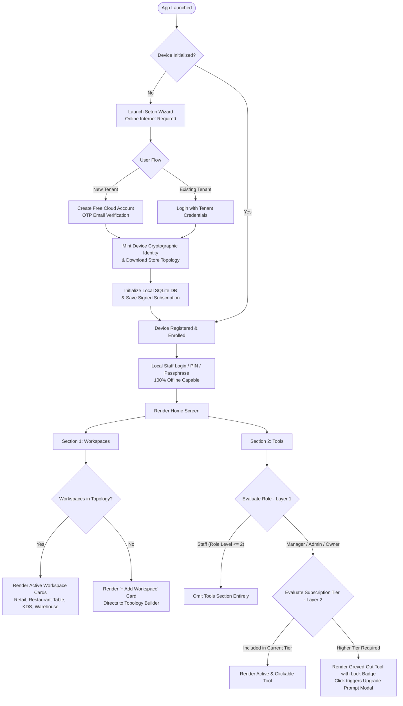

# ADR #41: App Lifecycle, Device Onboarding, Dynamic Topology Workspaces, and Two-Layer Gated Home Experience (Tier & RBAC)

**Status:** Accepted (2026-08-28)  
**Date:** 2026-08-28  
**Author:** Architecture Team & OZ-POS Contributors  
**Tags:** lifecycle, device-onboarding, setup-wizard, rbac, subscription-entitlements, topology-editor, workspaces, tools-gating, audit-log

---

## 1. Context & Motivation

OZ-POS operates as a hybrid architecture: an **offline-first, local-database runtime** (embedded SQLite on each desktop/tablet device) connected to a **multi-tenant cloud control plane** (licensing, sync, backups, and central management).

To provide enterprise-grade security, deterministic multi-terminal synchronization, and sustainable self-serve SaaS monetization without compromising offline resilience, the application requires an unambiguous architectural policy governing:

1. **Device Provisioning & Lifecycle**: Distinguishing between an uninitialized machine (new device requiring cloud registration) and an enrolled device operating offline.
2. **Dynamic Store Workspaces**: Ensuring home screen workspaces are compiled dynamically from the visual Topology Editor (ADR #22 / ADR #34) rather than hardcoded.
3. **Two-Layer Gated Tools System**: Unifying **Role-Based Access Control (RBAC)** and **Subscription Tier Entitlements** to protect sensitive operations while providing clean in-app discovery and upsell surfaces for higher-tier capabilities (e.g., Audit Logging, Whitelabeling, Lua Scripting).

---

## 2. Architectural Decisions



---

### 2.1 Device Lifecycle & First-Run Onboarding

The device lifecycle consists of two primary runtime states:

#### State A: New / Uninitialized Device (Mandatory Setup Wizard)
* **Pre-condition:** No local global SQLite database exists or `device_credentials` is unpopulated.
* **Network Requirement:** **Internet Connection is Mandatory.**
* **Onboarding Flow:**
  1. The application boots directly into the **Setup Wizard (`/setup`)**.
  2. The user either:
     * **Creates a Free Account:** Submits organization name, email, and password. Completes OTP email verification. The cloud control plane mints the tenant and applies the **Free Tier** license by default.
     * **Connects an Existing Account:** Authenticates with owner/admin credentials and selects the target Store/Branch location.
  3. The cloud control plane returns:
     * Cryptographically signed `tenant_subscription` token (ADR #5).
     * Unique hardware-bound `device_id` and ECDSA sync keypair.
     * The compiled store topology definition.
  4. The local SQLite database is provisioned and marked as `Enrolled`.

#### State B: Registered / Enrolled Device (Normal Operational Runtime)
* **Pre-condition:** Device holds valid local configuration and cryptographic identity.
* **Network Requirement:** **Offline-First (Zero Internet Required).**
* **Routine Flow:**
  1. Boots directly to the **Staff Login / Lock Screen (`/login`)**.
  2. Staff members authenticate against the local SQLite database using their PIN or password (hashed with Argon2id).
  3. All transactional capabilities (sales, inventory deduction, cash drawer shifts, and local audit logging) execute 100% locally.
  4. The background synchronization worker automatically transmits delta batches to the cloud when internet connectivity is available.

---

### 2.2 Home Screen Architecture: Dynamic Topology Workspaces

The primary area of the Home Screen displays the operational **Workspaces** of the store:

1. **Topology-Driven Rendering:** Workspaces are **never hardcoded**. The Home Screen queries active `workspace_instances` compiled from the store's visual **Topology Editor** (`crates/oz-core/src/topology/`).
2. **Node Types:** Supports all topology-defined nodes:
   * **Retail POS / Front Cashier**
   * **Table Service / Restaurant POS**
   * **Kitchen Display System (KDS)** (Metro / Kanban / Focus)
   * **Bar / Barista Station**
   * **Backroom Warehouse Dispatch**
3. **Empty Topology Guard:**
   * If a store has no active workspace instances configured, the home screen renders an explicit callout:
   * `[ + Add Workspace / Configure Store Topology ]`
   * Clicking this card routes authorized managers/owners directly to the Topology Builder to wire nodes and establish business connections.

---

### 2.3 Two-Layer Gated Tools System (RBAC + Subscription Tier)

The **Tools** section (Analytics, Reports, Staff Management, Settings, Audit Log, Lua Automations) is governed by a strict **Two-Layer Evaluation Pipeline**:

$$\text{Display State} = f(\text{User Role},\; \text{Subscription Tier},\; \text{Tool Metadata})$$

```
+-------------------------------------------------------------------------+
|                              TOOLS PIPELINE                             |
|                                                                         |
|  [Tool Item] ---> [ Layer 1: RBAC Gate ] ---> Denied? ---> HIDE (DOM)   |
|                            |                                            |
|                        Allowed?                                         |
|                            v                                            |
|                  [ Layer 2: Tier Gate ] ---> Included? --> ACTIVE       |
|                            |                                            |
|                        Missing?                                         |
|                            v                                            |
|               DISABLED / GREYED OUT (🔒 Lock + Upgrade Callout)         |
+-------------------------------------------------------------------------+
```

#### Layer 1: Role-Based Access Control (RBAC Gating)
Evaluated first. Enforces operational segregation and prevents non-management staff from viewing internal administrative tools.

* **Hierarchy:** `Owner (5)` > `Admin (4)` > `Manager (3)` > `Staff (2)` > `Auditor (1)`
* **Rules:**
  * **Staff (`role <= 2`)**: Cannot access or see the Tools section. The entire `TOOLS` container is omitted from the UI DOM. Staff members are kept strictly focused on their assigned POS / KDS workspaces.
  * **Manager (`role == 3`)**: Permitted to access operational tools (`Reports`, `Staff Management`, `Shifts`, `Settings`).
  * **Admin / Owner (`role >= 4`)**: Permitted to access all operational and high-privilege tools (`Analytics`, `Audit Log`, `Topology Builder`, `Billing`).
  * **Auditor (`role == 1`)**: Dedicated read-only access strictly to `Audit Log` and `Reports`.

#### Layer 2: Subscription Tier Entitlement (In-App Discoverability & Upsell UX)
Evaluated only after Layer 1 permissions pass. Enforces SaaS tier limits (Free, Plus, Pro, Premium, Enterprise) while maintaining feature discoverability.

* **Rule for In-Tier Features:** Rendered as active, fully interactive cards.
* **Rule for Higher-Tier Features (The "Greyed-Out" Policy):**
  * Features belonging to a higher tier (e.g., **Audit Log** on Free/Plus/Pro; **Whitelabeling** on Free/Plus/Pro; **Scheduled Reports** on Free/Plus) are **NOT hidden**.
  * They are rendered in a **disabled, greyed-out visual state** (`opacity: 0.5; filter: grayscale(0.5);`).
  * Display a **Lock Badge** (`🔒 Premium` or `🔒 Pro`).
  * Clicking the card opens an informative **Upgrade Modal** displaying the feature benefits and a direct path to upgrade the subscription tier.

---

## 3. Comprehensive Entitlement & Role Matrix

| Tool / Feature | Minimum Role | Free | Plus | Pro | Premium | Enterprise |
| :--- | :--- | :---: | :---: | :---: | :---: | :---: |
| **Retail / Quick POS** | Staff (2) | ✅ Active | ✅ Active | ✅ Active | ✅ Active | ✅ Active |
| **Kitchen Display (KDS)** | Staff (2) | 🔒 *Greyed* | 🔒 *Greyed* | ✅ Active | ✅ Active | ✅ Active |
| **Daily Sales Dashboard** | Manager (3) | 🔒 *Greyed* | ✅ Active | ✅ Active | ✅ Active | ✅ Active |
| **Reports & Inventory** | Manager (3) | 🔒 *Greyed* | 🔒 *Greyed* | ✅ Active | ✅ Active | ✅ Active |
| **Staff & Roles** | Manager (3) | ✅ (1 Staff) | ✅ (5 Staff) | ✅ (20 Staff) | ✅ (50 Staff) | ✅ (Unlimited) |
| **Analytics (Deep Trends)** | Admin (4) | 🔒 *Greyed* | 🔒 *Greyed* | ✅ Active | ✅ Active | ✅ Active |
| **Whitelabel Branding** | Admin (4) | 🔒 *Greyed* | 🔒 *Greyed* | 🔒 *Greyed* | ✅ Active | ✅ Active |
| **Audit Log (Tamper-Evident)**| Manager (3) | 🔒 *Greyed* | 🔒 *Greyed* | 🔒 *Greyed* | ✅ Active | ✅ Active |
| **Lua Scripting Automation**| Admin (4) | 🔒 *Greyed* | 🔒 *Greyed* | 🔒 *Greyed* | ✅ Active | ✅ Active |
| **Custom HAL Hardware** | Owner (5) | 🔒 *Greyed* | 🔒 *Greyed* | 🔒 *Greyed* | 🔒 *Greyed* | ✅ Active |

> **Note for Staff Role:** When a user with the `Staff` role logs in, all Tools above are completely hidden regardless of subscription tier.

---

## 4. Implementation Blueprint

### 4.1 UI Component Architecture (`ui/src/`)
* **`WorkspaceHome.tsx`**:
  * Consumes `useAuth()` to evaluate Layer 1 (RBAC). Returns early or hides `TOOLS` if `role === 'staff'`.
  * Queries `workspace_instances` from Topology Context. If length is 0, renders `AddWorkspaceCard`.
  * Passes each candidate tool through `useSubscription()` and `TierLockedFeature` to determine active vs. greyed-out locked state.
* **`TierLockedFeature.tsx`**:
  * Wraps gated tools. If current tier < required tier, attaches lock badge and intercepts click with `UpgradeModal`.

### 4.2 Backend & Engine Integration (`crates/` & `apps/`)
* **`crates/oz-core/src/subscription.rs`**: Single source of truth for tier definitions and feature capability checks (`allows_audit_log()`, `allows_kds()`, `allows_whitelabel()`).
* **`apps/desktop-client/src/commands/setup.rs`**: Implements the setup wizard device initialization and cloud credential minting routines.

---

## 5. Consequences

### Positive
* **Frictionless Onboarding:** Clear separation between first-time device registration and zero-friction daily offline operations.
* **Organic Upsell Conversion:** Store owners discover premium enterprise features (Audit Log, Lua, Whitelabel) naturally in their workflow without feeling artificially restricted by hidden menus.
* **Security & Staff Focus:** Line staff are shielded from operational complexities and compliance logs, minimizing UI clutter and potential fraud.
* **Topology Consistency:** Workspaces accurately reflect physical and logical store layouts compiled from the Topology Editor.

### Trade-offs & Mitigations
* **Initial Setup Requires Network:** First-time device provisioning cannot happen completely offline. *Mitigation:* Clear UI guidance on setup screen; once enrolled, device operates indefinitely offline within tier grace limits.
