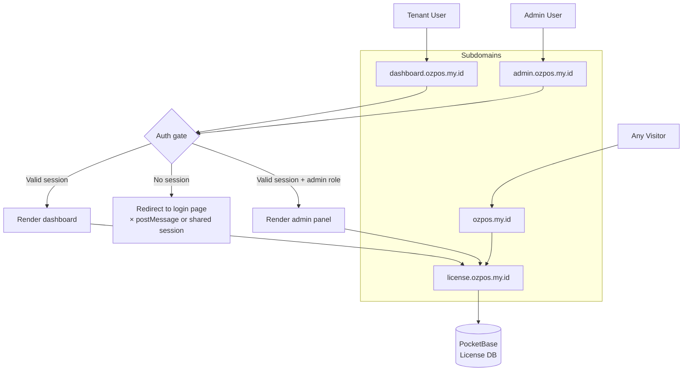

# ADR #42: Website Admin Dashboard & User Dashboard (Subdomain Architecture)

**Status:** Draft — Domain provisioning + auth gate + password rotation complete (2026-08-28)  
**Date:** 2026-08-28  
**Author:** Architecture Team & OZ-POS Contributors  
**Tags:** website, dashboard, admin, subdomain, auth, license-server, billing, tenant-management, password-rotation

---

## 1. Context & Motivation

The OZ-POS website (`ozpos.my.id` — Astro static site on Cloudflare Workers) currently has a single **account page** (`/account`, `AccountView.tsx`) after login that shows license status, subscription tier, and basic settings. It is a single-card-stack page with no dedicated subdomain, no dashboard, no admin panel.

As the platform grows, two distinct authenticated web surfaces are needed:

1. **User Dashboard** — for the tenant/customer after purchasing OZ-POS. Shows:
   - Subscription status, billing history, invoices
   - License activation, device management
   - Usage metrics (stores, terminals, staff count)
   - Upgrade/downgrade subscription
   - Support contact

2. **Admin Dashboard** — for OZ-POS internal operations. Shows:
   - Tenant list with search/filter (email, tier, status, date range)
   - Per-tenant drill-down: license, subscription, device count, usage
   - Manual license activation, renewal, revocation
   - Subscription tier override (with audit trail)
   - API key management for tenants
   - Invoice/payment history lookup
   - System health: license server uptime, webhook delivery status

Both require:
- **Authentication gating** — redirect to login if no valid session
- **Session persistence** beyond `sessionStorage` (cookie or refresh token)
- **Role-based access** — regular users see only their own dashboard; admins see the admin panel

### Current architecture

```
┌─────────────────────────────────────────────┐
│  ozpos.my.id (Cloudflare Workers · Astro)   │
│  /login   → AuthForm (OTP + email code)     │
│  /account → AccountView (license, sub, pw)   │
│  /signup, /pricing, /download, /docs, …     │
└─────────────────────────────────────────────┘
        │
        ▼  HTTPS (Bearer token)
┌─────────────────────────────────────────────┐
│  license.ozpos.my.id (PocketBase · Go)      │
│  /api/v1/web/me                             │
│  /api/v1/web/request-otp                     │
│  /api/v1/web/set-password                    │
│  /api/v1/web/logout                          │
│  /api/v1/web/contact                         │
│  /api/v1/midtrans/snap                       │
│  /api/v1/license/activate, /renew, /status   │
└─────────────────────────────────────────────┘
```

**Problems with the current `/account` page:**

| Aspect | Issue |
|--------|-------|
| **Session** | `sessionStorage` only — lost on tab close, no "remember me" |
| **Scope** | Single-card-stack, no dashboard metrics, no navigation |
| **Admin** | No admin panel exists — internal operations require direct PocketBase access |
| **Subdomain** | Mixed with the marketing site (`ozpos.my.id/account`) — no separation of concerns |
| **Data** | No usage metrics, no billing history, no store/terminal counts on the web |

---

## 2. Architectural Decisions



### 2.1 Subdomain Routing

| Subdomain | Purpose | Target | Auth |
|-----------|---------|--------|------|
| `dashboard.ozpos.my.id` | User dashboard (tenant-facing) | Cloudflare Workers — Astro SPA | JWT session (cookie or localStorage + short-lived token) |
| `admin.ozpos.my.id` | Admin dashboard (internal OZ-POS) | Cloudflare Workers — Astro SPA | JWT session + `role: admin` claim |
| `ozpos.my.id` | Marketing site (public) | Current Astro site — unchanged | Public (login page handled here) |

All three subdomains share the same Cloudflare Workers deployment (route-based routing) or separate Workers with a shared auth domain.

### 2.2 Authentication Architecture

**Decision:** Use **httpOnly cookie-based sessions** (not `sessionStorage`) for the dashboard subdomains.

- The login flow (`ozpos.my.id/login`) sends email + OTP, receives a JWT, then sets an httpOnly cookie scoped to `.ozpos.my.id` (shared across subdomains).
- Dashboard subdomains read the cookie on every request (Cloudflare Workers middleware), decode the JWT, and attach the tenant/admin identity.
- If the cookie is missing or expired, the worker returns a 302 redirect to `ozpos.my.id/login` with a `?redirect=` parameter so the user lands back on the dashboard after login.

**Benefit:** httpOnly cookies are not accessible to JavaScript, mitigating XSS token theft. The cookie is shared across `dashboard.ozpos.my.id` and `admin.ozpos.my.id` via a wildcard domain cookie.

**Alternative considered:** `localStorage` + Bearer header — simpler but vulnerable to XSS. Rejected.

### 2.3 User Dashboard (`dashboard.ozpos.my.id`)

A single-page application dashboard with a sidebar navigation and content area. Sections:

| Section | Data Source | Description |
|---------|-------------|-------------|
| **Overview** | `GET /api/v1/web/me` + `GET /api/v1/web/usage` | Tier, status, store/terminal/staff counts, next billing date |
| **Subscription** | `GET /api/v1/web/me` + `POST /api/v1/midtrans/snap` | Current plan, renewal date, upgrade/downgrade buttons, bundle upgrades |
| **Billing** | `GET /api/v1/web/invoices` | Invoice list, payment history, download receipt |
| **Devices** | `GET /api/v1/web/devices` | Registered terminals, unbind button, activation guide |
| **License** | `GET /api/v1/web/me` | License key, copy, activation status |
| **Settings** | `PATCH /api/v1/web/settings` | Password, region, notification preferences |

### 2.4 Admin Dashboard (`admin.ozpos.my.id`)

A single-page application with two main sections:

**Tenant Management:**
- Searchable table of all tenants (email, status, tier, created date, device count)
- Per-tenant detail panel: license, subscription, device list, activity log
- Actions: activate license, renew subscription, revoke, tier override
- Export to CSV

**System:**
- License server health check
- Webhook delivery log (Paddle → webhook → tenant provisioning)
- API key management
- Manual invoice generation

**Access control:** Only users with `role: admin` in their JWT claims can access `admin.ozpos.my.id`. Non-admin users are redirected to `dashboard.ozpos.my.id`.

### 2.5 Auth Gate Implementation

A Cloudflare Workers middleware on both dashboard subdomains:

```typescript
// Pseudocode — middleware on every dashboard route
async function handleRequest(request: Request): Promise<Response> {
  const cookie = parseCookies(request.headers.get('Cookie') ?? '');
  const jwt = cookie['oz_session'];

  if (!jwt) {
    const url = new URL(request.url);
    return Response.redirect(`https://ozpos.my.id/login?redirect=${encodeURIComponent(url.pathname)}`, 302);
  }

  try {
    const payload = verifyJwt(jwt, JWKS_URI); // Signed by license server
    request.ctx = { tenantId: payload.sub, role: payload.role, email: payload.email };

    // Admin subdomain check
    if (request.url.hostname === 'admin.ozpos.my.id' && payload.role !== 'admin') {
      return Response.redirect('https://dashboard.ozpos.my.id', 302);
    }

    return await next(request);
  } catch {
    // Invalid/expired JWT — redirect to login
    return Response.redirect(`https://ozpos.my.id/login?redirect=${encodeURIComponent(url.pathname)}`, 302);
  }
}
```

### 2.6 New License Server API Endpoints

The license server (PocketBase) needs new web API routes to support the dashboards:

| Method | Path | Description | Auth |
|--------|------|-------------|------|
| `GET` | `/api/v1/web/usage` | Tenant usage stats (store count, terminal count, staff count, storage used) | JWT (tenant) |
| `GET` | `/api/v1/web/invoices` | Invoice/payment history for the tenant | JWT (tenant) |
| `GET` | `/api/v1/web/devices` | Registered devices for the tenant | JWT (tenant) |
| `PATCH` | `/api/v1/web/settings` | Update tenant preferences (region, notifications) | JWT (tenant) |
| `GET` | `/api/v1/admin/tenants` | List all tenants (paginated, filterable) | JWT (admin) |
| `GET` | `/api/v1/admin/tenants/:id` | Single tenant detail | JWT (admin) |
| `POST` | `/api/v1/admin/tenants/:id/activate` | Activate license for tenant | JWT (admin) |
| `POST` | `/api/v1/admin/tenants/:id/renew` | Renew subscription | JWT (admin) |
| `POST` | `/api/v1/admin/tenants/:id/revoke` | Revoke license | JWT (admin) |
| `POST` | `/api/v1/admin/tenants/:id/tier-override` | Override subscription tier (with audit reason) | JWT (admin) |
| `GET` | `/api/v1/admin/webhooks` | Webhook delivery log | JWT (admin) |
| `GET` | `/api/v1/admin/health` | License server health + metrics | JWT (admin) |

### 2.7 Cookie-Based JWT Session

The login flow (`ozpos.my.id/login` → `AuthForm.tsx`) is updated to:

1. After successful OTP verification, the license server returns a JWT **and** sets an httpOnly cookie on the response (`Set-Cookie: oz_session=<jwt>; Domain=.ozpos.my.id; Path=/; HttpOnly; Secure; SameSite=Lax`).
2. The `AuthForm.tsx` stores the JWT in `sessionStorage` (for backward-compatible `/account` page access) in addition to the cookie.
3. All dashboard subdomains read the cookie automatically on every request.

---

## 3. Consequences

### 3.1 Positive

- **Clear separation of concerns:** marketing site, user dashboard, and admin panel each have their own subdomain
- **Shared auth domain:** `.ozpos.my.id` cookie works across all subdomains
- **httpOnly cookies:** Mitigate XSS token theft on the dashboard SPAs
- **Admin panel:** Eliminates direct PocketBase access for internal operations — reduces risk of accidental data corruption
- **Billing/usage data on the web:** Tenants can see their subscription details without opening the desktop app
- **Extensible:** New dashboard sections (analytics, reports) can be added later without touching the marketing site

### 3.2 Negative

- **Cookie-based auth on CF Workers:** Requires JWT verification on every dashboard request (worker CPU time, though fast with a cached JWKS)
- **New API endpoints:** 12 new routes on the license server, each requiring testing and documentation
- **Auth flow complexity:** The redirect-based auth gate means the login page must preserve the `?redirect=` parameter and redirect back after login
- **Cross-origin cookie:** The `Domain=.ozpos.my.id` cookie is sent to ALL ozpos subdomains, including the marketing site. The marketing site is Astro (static, no JS processing of the cookie needed), but the cookie is still transmitted on every request — minor overhead.

### 3.3 Risk Mitigation

| Risk | Mitigation |
|------|------------|
| JWT cookie shared across subdomains | The JWT payload includes `aud` (audience) claim — the dashboard workers verify the audience matches |
| Admin endpoints exposed | JWT verification + `role: admin` claim check on every admin endpoint |
| Cookie deleted on browser close | Use `Max-Age: 30 days` (not `Session` cookie) for "remember me" behavior |
| Login redirect loop | `?redirect=` parameter is sanitized (only allow same-origin paths) |

---

## 4. Implementation Plan

### Phase 1 — Foundation (Week 1)

1. Update license server to issue httpOnly cookie on login (`POST /api/v1/web/login` or add `Set-Cookie` to existing OTP verification)
2. Add `GET /api/v1/web/usage`, `GET /api/v1/web/invoices`, `GET /api/v1/web/devices` endpoints
3. Create Cloudflare Workers route for `dashboard.ozpos.my.id` (new Astro SPA or separate JS bundle)
4. Implement auth gate middleware (cookie → JWT verify → redirect or render)

### Phase 2 — User Dashboard (Week 2)

5. Build dashboard SPA: Overview, Subscription, Billing, Devices, License, Settings sections
6. Migrate existing `/account` functionality into the dashboard
7. Add sidebar navigation, responsive layout
8. Update login flow to support `?redirect=` parameter

### Phase 3 — Admin Dashboard (Week 3)

9. Add admin API endpoints to license server
10. Build admin SPA: Tenant list, tenant detail, actions (activate/renew/revoke/override)
11. Add role-based access control (JWT `role: admin` claim)
12. Create Cloudflare Workers route for `admin.ozpos.my.id`

### Phase 4 — Polish (Week 4)

13. Add usage metrics (store/terminal/staff counts) to the dashboard overview
14. Invoice/payment history from Paddle webhook log
15. Webhook delivery log on admin panel
16. E2E tests for auth gate + dashboard flows

### Phase 5 — Admin Password Rotation (Implemented)

17. **Password rotation reminder** — implemented in `apps/license-server/password_rotation.go`:
    - `OnRecordAfterUpdateSuccess("_superusers")` hook detects password hash changes by diffing against a stored snapshot in `password_rotation_state` collection
    - Daily scheduler (`startPasswordRotationScheduler`) runs at 08:00 UTC
    - Sends reminder email to the superuser (default `adikaradwiatmaja@gmail.com`, overridable via `OZ_ADMIN_EMAIL`) when password age >= 120 days
    - Repeats every 30 days until the password is changed (idempotent via `last_reminder_at`)
    - Uses the same SMTP relay as the trial email system (Brevo via `OZ_SMTP_*` env vars)
    - 5 tests covering seed, scanner, 30-day interval, and email content

### Phase 2/3 — Dashboard SPAs + API (Implemented)

18. **User dashboard API** (`apps/license-server/web_dashboard.go`): `GET /api/v1/web/usage` (device/subscription counts + entitlement limits), `GET /api/v1/web/devices` (tenant machines) — session-authed like `/me`.
19. **Admin dashboard API** (`apps/license-server/admin_dashboard.go`): `GET /api/v1/admin/tenants`, `GET /tenants/{id}` (detail + devices), `POST /tenants/{id}/activate`, `/renew` (+N days), `/revoke`, `/tier-override` (with reason), `GET /api/v1/admin/health`. Auth: `OZ_ADMIN_KEY` bearer OR a web session of the admin tenant (`OZ_ADMIN_EMAIL`).
20. **CORS**: default allowlist now includes `dashboard.ozpos.my.id` and `admin.ozpos.my.id`.
21. **Worker** (`website/worker.ts`): `/__oz/session` endpoint returns the JWT from the httpOnly cookie (same-origin) so the SPAs can authenticate; dashboard/admin hostnames serve real SPAs from ASSETS (path-rewritten).
22. **Dashboard SPAs** (`website/public/dashboard/`, `website/public/admin/`): user dashboard (account/license/subscription/usage/devices) and admin panel (tenant list, drill-down, activate/renew/revoke/upgrade, health).
23. **Tests**: `dashboard_api_test.go` (6 tests) + worker tests (14). Full license-server suite passes.

---

## 5. Open Questions

1. **Shared Worker vs separate Workers?** A single Cloudflare Worker can route by hostname (`request.url.hostname`) and serve the appropriate app. This simplifies deployment (one Worker, one CI pipeline). A separate Worker per subdomain is more isolated but doubles deployment complexity. **Recommendation:** single Worker with hostname-based routing. ✅ Chosen — implemented in worker.ts.
2. **Dashboard tech stack?** Same Astro + React setup as the existing website (shared components, i18n, styling). The dashboard SPAs can be Astro islands or full React SPAs mounted at [`client:only`](https://docs.astro.build/en/reference/directives-reference/#clientonly). ✅ Chosen — standalone static SPAs served from ASSETS (no marketing-site coupling).
3. **Invoice data source?** Paddle webhook events (stored in PocketBase `webhook_log` collection) or a new `invoices` collection. **Recommendation:** store processed invoice data in a dedicated `invoices` PocketBase collection, populated by the Paddle webhook handler. (Not yet built — the billing section shows license/subscription state; invoice history is future work.)