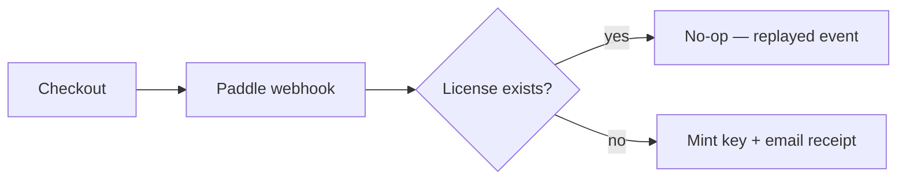
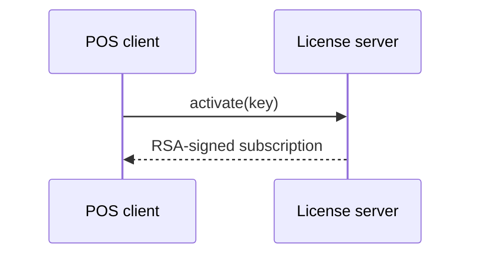

## Callouts

Callouts highlight important information. Write a blockquote whose first line
starts with a bold label — the label picks the color:

> **Note:** General information worth knowing. The default callout style.

> **Info:** Background context or additional details.

> **Tip:** A shortcut, best practice, or recommended approach.

> **Warning:** Something to be careful about — it may not do what you expect.

> **Danger:** An action that can cause data loss or break an installation.

Any text after the bold label is the callout body:

> **Warning:** Always back up your database before running a migration.

## Links

Relative links between docs pages use the page slug:

```
See the [cloud sync](../cloud-sync/) guide.
```

Renders as: See the [cloud sync](../cloud-sync/) guide.

## Tables

Pipe tables render with a bordered style:

| Feature        | Included |
| -------------- | -------- |
| Cloud sync     | ✓        |
| QRIS payments  | ✓        |
| Lua scripting  | ✓        |

## Code

Inline code uses backticks, e.g. `Money::from_minor(1000)`. Fenced blocks
render in a bordered, scrollable box:

```rust
let total = cart.total();
let due = total - discount;
```

## Charts & diagrams

Charts are written as text, not pasted as images. The site uses **Mermaid** —
diagrams live in fenced `mermaid` blocks and are rendered to static SVG at
build time (through the same rehype pipeline as callouts), so pages stay
JavaScript-free and the CSP never changes. If a `mermaid` block ever shows up
as plain text, the renderer is not wired into `astro.config.mjs` yet.

> **Note:** Mermaid is for structure — flows, sequences, states, and
> relationships. For numbers (pricing, quotas, feature comparisons) keep using
> tables, and for what the app actually looks like use a real screenshot.
> Mermaid's statistical charts (pie, bar) are too limited to carry data.

### Flowchart



### Sequence diagram



### Branded diagrams

For a hero diagram that must match the site exactly — the dark/light toggle
included — hand-build an inline SVG instead of using Mermaid. Every fill and
stroke is a design-token `var()`, so the diagram re-themes with the page.
See [Offline-First Mode](../offline-mode/) for a working example.

- Outlines, arrows, and the arrowhead use `var(--color-accent)` (the green
  brand color); box fills use `var(--color-surface)`; labels use
  `var(--color-ink)`; edge labels use `var(--color-muted)`.
- Add `class="docs-flow"` to the `<svg>` so it scales down on small screens
  (the rule lives in `global.css`), and keep the canvas close to 760×250
  with one row of about five boxes — a hero diagram must read at a glance.
- Short labels fit on one line; longer ones use two `<tspan>` lines inside
  the `<text>` instead of a wider box.
- Use a diamond `<polygon>` for a decision, and label every edge ("yes",
  "no", "reconnect") with 12px muted text.
- Define one `<marker id="flow-arrow">` arrowhead in `<defs>` and reference
  it from every line via `marker-end="url(#flow-arrow)"`.
- Give the `<svg>` `role="img"` and an `aria-label` that describes the flow.
- Keep the markup on contiguous lines — a blank line inside the tag breaks
  it out of the HTML block.

### Rules

- One idea per diagram; keep it under ~10 nodes.
- Label every edge; never rely on color alone to carry meaning.
- Add a plain-text summary after every diagram — screen readers and search
  engines read the markdown, not the SVG.
- Keep the `mermaid` source in the page. Never replace it with an exported
  PNG: the source is what stays reviewable, diffable, and translatable.
