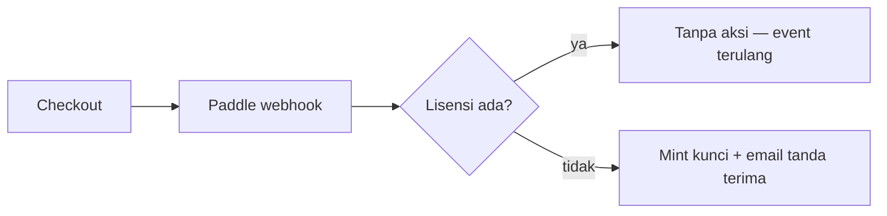
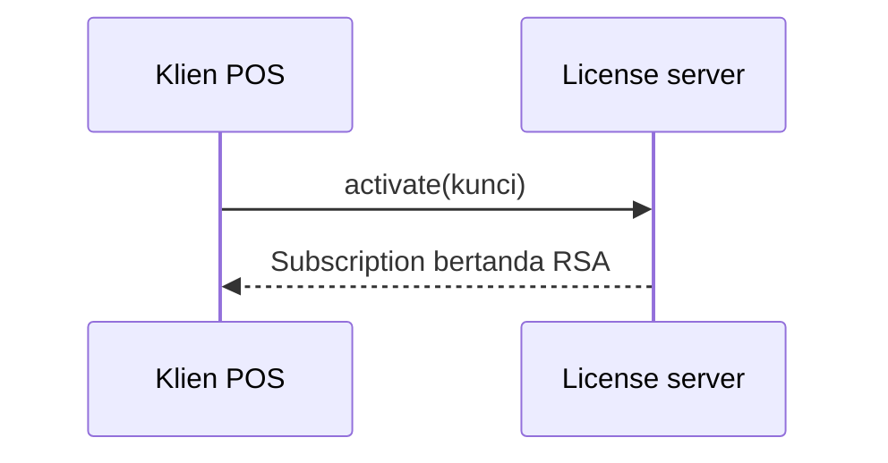

## Callout

Callout menyoroti informasi penting. Tulis blockquote yang baris pertamanya
diawali label tebal — label menentukan warnanya:

> **Catatan:** Informasi umum yang perlu diketahui. Gaya callout bawaan.

> **Info:** Konteks latar belakang atau detail tambahan.

> **Tip:** Pintasan, praktik terbaik, atau pendekatan yang disarankan.

> **Warning:** Sesuatu yang perlu diwaspadai — hasilnya mungkin tidak sesuai harapan.

> **Danger:** Tindakan yang dapat menyebabkan kehilangan data atau merusak instalasi.

Teks apa pun setelah label tebal adalah isi callout:

> **Warning:** Selalu buat cadangan database sebelum menjalankan migrasi.

## Tautan

Tautan relatif antar halaman dokumentasi memakai slug halaman:

```
Lihat panduan [sinkron cloud](../cloud-sync/).
```

Hasilnya: Lihat panduan [sinkron cloud](../cloud-sync/).

## Tabel

Tabel pipa dirender dengan gaya berbingkai:

| Fitur           | Termasuk |
| --------------- | -------- |
| Sinkron cloud   | ✓        |
| Pembayaran QRIS | ✓        |
| Skrip Lua       | ✓        |

## Kode

Kode inline memakai backtick, mis. `Money::from_minor(1000)`. Blok fenced
dirender dalam kotak berbingkai yang bisa digulir:

```rust
let total = cart.total();
let due = total - discount;
```

## Bagan & Diagram

Bagan ditulis sebagai teks, bukan ditempel sebagai gambar. Situs ini memakai
**Mermaid** — diagram ditulis dalam blok fenced `mermaid` lalu dirender menjadi
SVG statis saat build (melalui pipeline rehype yang sama dengan callout), jadi
halaman tetap bebas JavaScript dan CSP tidak pernah berubah. Jika blok
`mermaid` tampil sebagai teks biasa, artinya perender belum dipasang di
`astro.config.mjs`.

> **Catatan:** Mermaid untuk struktur — alur, sekuens, keadaan, dan relasi.
> Untuk angka (harga, kuota, perbandingan fitur) tetap gunakan tabel, dan
> untuk tampilan aplikasi yang sebenarnya gunakan tangkapan layar. Bagan
> statistik Mermaid (pie, bar) terlalu terbatas untuk memuat data.

### Flowchart



### Diagram sekuens



### Diagram bermerek

Untuk diagram utama yang harus benar-benar cocok dengan situs — termasuk
toggle gelap/terang — buat SVG inline dengan tangan alih-alih memakai Mermaid.
Setiap isian dan garis memakai `var()` token desain, sehingga diagram ikut
berganti tema bersama halaman. Lihat [Mode Offline-First](../offline-mode/)
untuk contoh yang berfungsi.

- Garis luar, panah, dan kepala panah memakai `var(--color-accent)` (warna
  merek hijau); isian kotak memakai `var(--color-surface)`; label memakai
  `var(--color-ink)`; label tepi memakai `var(--color-muted)`.
- Tambahkan `class="docs-flow"` ke `<svg>` agar diagram menyusut di layar
  kecil (aturannya ada di `global.css`), dan jaga kanvas sekitar 760×250
  dengan satu baris sekitar lima kotak — diagram utama harus terbaca
  sekilas.
- Label pendek muat dalam satu baris; yang panjang pakai dua baris `<tspan>`
  di dalam `<text>` alih-alih kotak yang lebih lebar.
- Gunakan diamond `<polygon>` untuk percabangan, dan beri label setiap tepi
  ("ya", "tidak", "koneksi kembali") dengan teks muted 12px.
- Definisikan satu kepala panah `<marker id="flow-arrow">` di dalam
  `<defs>` dan rujuk dari setiap garis via `marker-end="url(#flow-arrow)"`.
- Beri `<svg>` atribut `role="img"` dan `aria-label` yang menjelaskan
  alurnya.
- Jaga markup pada baris yang bersambung — baris kosong di dalam tag akan
  memecahnya keluar dari blok HTML.

### Aturan

- Satu ide per diagram; jaga di bawah ~10 node.
- Beri label pada setiap tepi; jangan pernah hanya mengandalkan warna.
- Tambahkan ringkasan teks biasa setelah setiap diagram — pembaca layar dan
  mesin pencari membaca markdown, bukan SVG.
- Simpan sumber `mermaid` di halaman. Jangan menggantinya dengan PNG hasil
  ekspor: sumber itulah yang tetap bisa ditinjau, di-diff, dan diterjemahkan.
